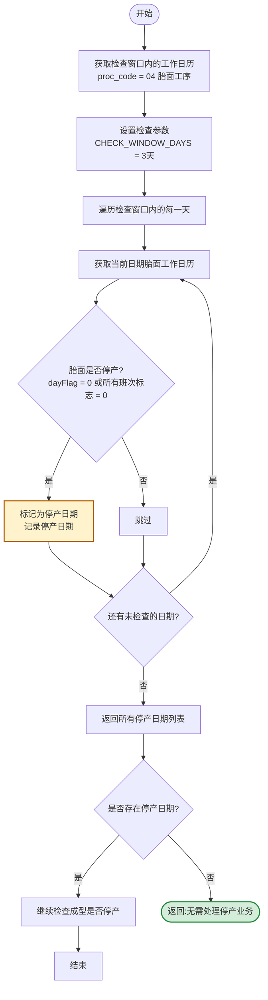
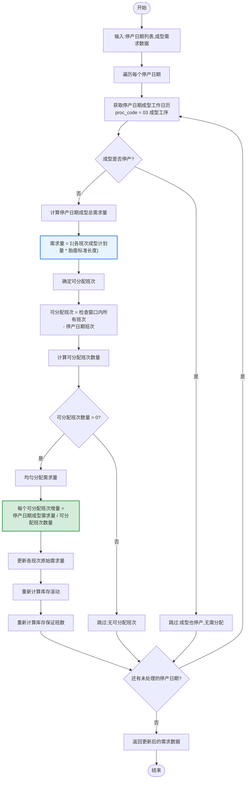
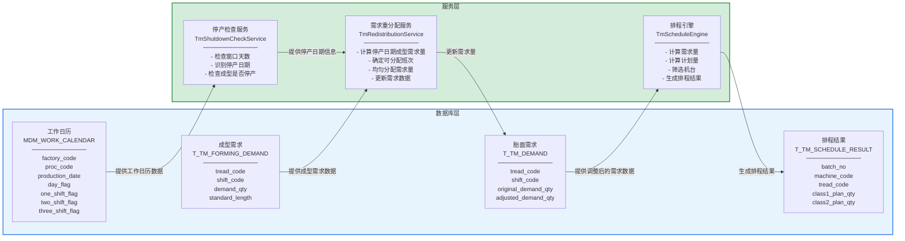

# 胎面排程停产业务逻辑流程图

技术实现指导文档 - Mermaid格式

## 导航

1. [主流程](#1-主流程含停产业务逻辑)
2. [停产检查子流程](#2-停产检查子流程)
3. [需求重分配子流程](#3-需求重分配子流程)
4. [数据流转图](#4-数据流转图)

---

## 1. 主流程（含停产业务逻辑）

完整的胎面自动排程流程，包含停产业务逻辑处理。在Step12（计算收尾和非收尾实际排产量）之后，Step13（处理停产收尾和开产阈值）之前，插入停产业务逻辑处理。

```mermaid
flowchart TD
    A([开始自动排程]) --> B[选择排程日期<br/>默认服务器时间下一天]
    B --> C{当天是否已有旧排程?}
    
    C -->|没有旧结果| D[允许生成<br/>生成 batch_no和trace_id]
    C -->|旧结果全部未发布| E{用户确认覆盖?}
    C -->|存在已发布结果| F([拒绝生成<br/>提示已有发布过的生成计划])
    
    E -->|是| D
    E -->|否| G([结束:不生成新排程])
    
    D --> H[解析成型计划和BOM<br/>得到胎面规格 胶料 口型板 6班需求来源]
    H --> I{需求算法参数<br/>DEMAND_QTY_CALCULATE_TYPE}
    
    I -->|算法1| J[每班需求量 = 成型三班最大计划量 * 胎面标准长度]
    I -->|算法2| K[每班需求量 = 下个班成型计划量 * 胎面标准长度]
    
    J --> L["读取6点胎面库存<br/>计算14点预计库存<br/>rollingStockQty = sixClockStockQty - 早班需求量 + 早班计划量"]
    K --> L
    
    subgraph shutdown["停产业务逻辑处理"]
        L --> M[获取检查窗口内的工作日历]
        M --> N[识别胎面停产日期]
        N --> O{是否存在胎面停产日期?}
        
        O -->|是| P[检查对应日期成型是否停产]
        O -->|否| Q[跳过停产业务逻辑]
        
        P --> R{成型是否停产?}
        R -->|否| S[计算停产日期成型需求量]
        R -->|是| T[跳过需求重分配]
        
        S --> U[确定可分配班次]
        U --> V[均匀分配需求量]
        V --> W[更新各班次需求量]
        W --> X["重新计算库存滚动<br/>rollingStockQty(下班) = rollingStockQty(当前班) + 当前班计划量 - 当前班需求量"]
    end
    
    X --> Y[建立机台班次任务链<br/>按机台 + 班次 + 顺序组织已有任务]
    Q --> Y
    T --> Y
    
    Y --> Z[逐班滚动计算<br/>从当前班开始看未来保证班数]
    
    Z --> AA["计算库存保证班数和供应时长<br/>──────────────<br/>guardDemandQty = 保证范围内成型胎面需求量合计<br/>currentShiftDemandQty = 当前班成型胎面需求量<br/>coverage_shift_count = 库存满足成型消耗的班数<br/>futureDemandPerHour = 未来保证范围内需求量 / 总小时数<br/>supplyHours = rollingStockQty / futureDemandPerHour<br/>stock_shortage_time = 库存不足时间<br/>──────────────<br/>判断哪些胎面最紧急"]
    
    AA --> BB[待排规格排序<br/>强紧急>库存紧急>同胶料>胶料优先级>基部胶>口型>稳定兜底]
    BB --> CC{能选出下一个胎面规格?}
    
    CC -->|否| DD[写未排<br/>原因:无符合条件规格或胶料库存不足]
    CC -->|是| EE["计算需排产量<br/>──────────────<br/>stockGapQty = max(guardDemandQty - rollingStockQty, 0)<br/>baseDemandQty = max(currentShiftDemandQty, stockGapQty)<br/>──────────────<br/>planQty初始值 = baseDemandQty"]
    
    EE --> FF["按工装限制计划量<br/>──────────────<br/>当前可用工装数量 = 总工装 - (6点库存 / 工装卷曲长度)<br/>工装限制最大可排米数 = 当前可用工装数量 * 工装卷曲长度<br/>planQty = min(planQty, 工装限制最大可排米数)<br/>──────────────<br/>下班次可用工装数量 =<br/>  上班次可用工装数量<br/>  - 当前班计划量 / 工装卷曲长度<br/>  + 成型对应班次需求量 / 工装卷曲长度"]
    
    FF --> GG["计算实际排产量<br/>──────────────<br/>如果 0 < planQty < TM_MIN_START_QTY 则补足到最小起排量<br/>非收尾实际排产 = 向上取整(planQty / 卷曲长度) * 卷曲长度<br/>收尾规格实际排产 = min(planQty, 胎面的余量) * (100% + 损耗率)<br/>──────────────<br/>最小起排 卷曲取整 收尾 损耗"]
    
    GG --> HH[处理停产收尾和开产阈值<br/>必要时调整本班排产量]
    
    HH --> II[筛选候选机台<br/>状态>产能>口型>胶料>定点>禁排]
    II --> JJ{是否存在可用机台?}
    
    JJ -->|否| KK[写未排<br/>原因:无可用机台或全部被规则过滤]
    JJ -->|是| LL[候选机台评分<br/>剩余产能>同胶料>基部胶>同口型>切换成本>定点生产]
    
    LL --> MM[选择最高分机台<br/>同分按机台编码升序]
    MM --> NN["扣减机台产能<br/>──────────────<br/>扣减产能 = (检修时长 + 规格切换时长 + 胶料切换时长) * 生产速度<br/>机台剩余产能 = 最大产能 - 扣减产能 - 已排计划量<br/>planQty = min(planQty, 机台剩余产能)<br/>──────────────<br/>计划量不能超过剩余产能"]
    
    NN --> OO{压缩后计划量是否仍可排?}
    
    OO -->|否| PP[写未排<br/>原因:产能不足或计划量不足]
    OO -->|是| QQ[追加到机台当前班任务链末尾<br/>生成classN_sequence,classN_plan_qty]
    
    QQ --> RR[写入结果表和解释表<br/>记录公式 规则命中 候选机台 选机原因]
    DD --> SS[写入未排结果和未排解释]
    KK --> SS
    PP --> SS
    
    RR --> TT{当前班是否还有可排规格和产能?}
    SS --> TT
    
    TT -->|是| AA
    TT -->|否| UU{6个班是否全部完成?}
    
    UU -->|是| VV[汇总已排数,未排数,异常数<br/>返回本次batch_no]
    UU -->|否| WW["滚动到下一班<br/>──────────────<br/>rollingStockQty(下班) = rollingStockQty(当前班) + 当前班计划量 - 当前班需求量<br/>机台剩余产能更新<br/>工装可用数量更新<br/>待排规格优先级更新<br/>──────────────<br/>更新库存 产能 任务链"]
    
    VV --> XX([结束])
    WW --> AA
    
    style shutdown fill:#e8f4fd,stroke:#1f6feb,stroke-width:2px
```

> **注意:** 停产业务逻辑处理是在库存初始化之后、建立机台任务链之前执行。这确保了调整后的需求量能够正确参与后续的排程计算。

---

## 2. 停产检查子流程

检查可配置窗口内的胎面停产日期，并验证对应日期的成型是否停产。只有当胎面停产但成型不停产时，才需要进行需求重分配。

### 参数配置

| 参数名称 | 参数代码 | 默认值 | 说明 |
|---------|---------|-------|------|
| 停产检查窗口天数 | TM_SHUTDOWN_CHECK_WINDOW | 3 | 检查未来几天内的停产情况，建议3-7天 |
| 停产业务逻辑开关 | TM_SHUTDOWN_REDISTRIBUTION_ENABLED | 1 | 是否启用停产业务逻辑处理 |

> **业务规则:**
> - 工作日历中 `dayFlag = 0` 表示整天停产
> - 所有班次标志（one_shift_flag, two_shift_flag, three_shift_flag）都为0也表示停产
> - 检查窗口天数可通过参数 `TM_SHUTDOWN_CHECK_WINDOW` 配置

---

## 3. 需求重分配子流程

将停产日期对应的成型需求量均匀分配到其他可排班次，确保成型生产线不会因为胎面停产而断供。

### 核心算法

### 计算公式

| 公式 | 说明 |
|-----|------|
| `成型需求量 = Σ(各班次成型计划量 × 胎面标准长度)` | 计算停产日期成型对胎面的总需求量 |
| `可分配班次 = 检查窗口内所有班次 - 停产日期班次` | 确定可以接受额外需求的班次 |
| `每个班次增量 = 停产日期成型需求量 / 可分配班次数量` | 均匀分配需求量到各可排班次 |
| `调整后需求量 = 原始需求量 + 增量` | 更新各班次的需求量 |

> **示例:**
> 排程日期:2026-06-14，检查窗口:3天
> 胎面停产日期:2026-06-16
> 成型需求:2026-06-16成型需要1000米胎面
> 可分配班次:2026-06-14的3个班次和2026-06-15的3个班次
> 每个班次增量:1000/6 ≈ 166.67米

---

## 4. 数据流转图

展示停产业务逻辑处理过程中的数据流向，包括工作日历、成型需求、胎面需求和排程结果之间的关系。

### 数据表说明

| 数据表 | 用途 | 关键字段 |
|-------|------|---------|
| T_MDM_WORK_CALENDAR | 存储各工序的工作日历，包含开停产标志 | factory_code, proc_code, production_date, day_flag, *_shift_flag |
| T_TM_FORMING_DEMAND | 存储成型工序对胎面的需求数据 | tread_code, shift_code, demand_qty, standard_length |
| T_TM_DEMAND | 存储胎面工序的原始和调整后需求量 | tread_code, shift_code, original_demand_qty, adjusted_demand_qty |
| T_TM_SCHEDULE_RESULT | 存储最终的排程结果 | batch_no, machine_code, tread_code, class*_plan_qty |

### 服务调用流程

| 步骤 | 服务 | 输入 | 输出 |
|-----|------|------|------|
| 1 | 停产检查服务 | 工作日历数据、检查窗口天数 | 停产日期列表 |
| 2 | 需求重分配服务 | 停产日期列表、成型需求数据 | 调整后的需求数据 |
| 3 | 排程引擎 | 调整后的需求数据 | 排程结果 |

---

## 文件说明

本文档包含两个版本的流程图:

1. **HTML版本** (`tm_shutdown_redistribution_mermaid.html`):
   - 使用Mermaid.js库渲染
   - 支持交互式查看（缩放、拖拽）
   - 包含导航菜单
   - 可直接在浏览器中打开

2. **Markdown版本** (`tm_shutdown_redistribution_mermaid.md`):
   - 纯文本格式
   - 可在任何Markdown编辑器中查看
   - 支持版本控制

## 使用方式

### HTML版本
1. 在浏览器中打开 `tm_shutdown_redistribution_mermaid.html`
2. 使用顶部导航菜单跳转到不同流程图
3. 支持缩放和拖拽查看大流程图

### Markdown版本
1. 在支持Mermaid的Markdown编辑器中打开
2. 如:VS Code + Mermaid插件、Typora、Obsidian等
3. 流程图将自动渲染

---

最后更新时间:2024年1月
