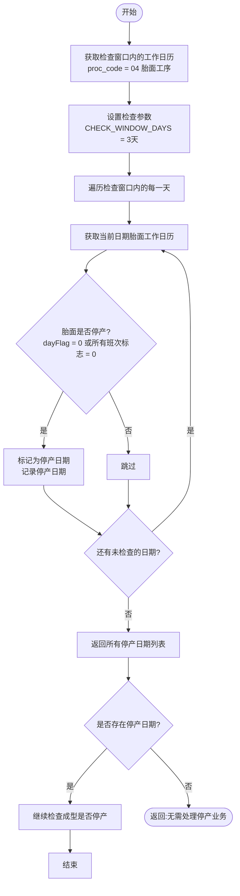
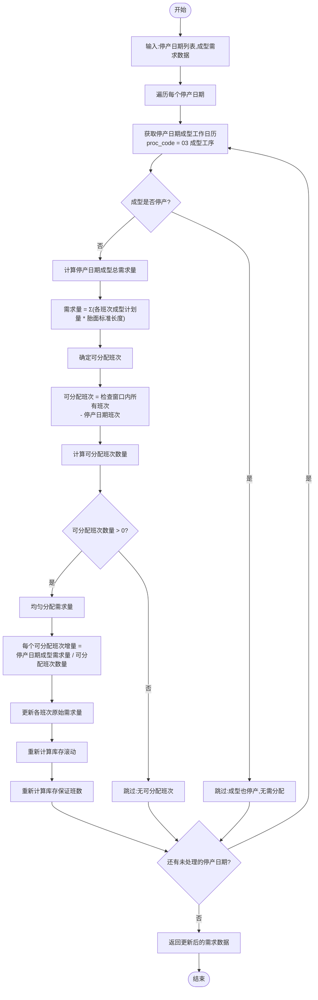
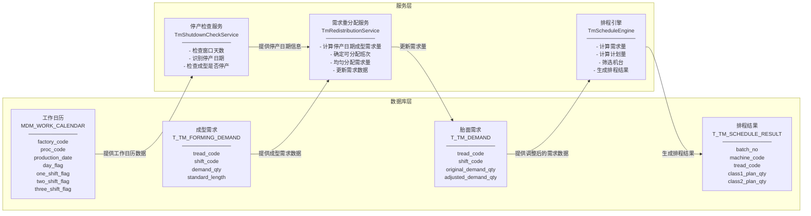

# 胎面排程重构详细设计说明

## 1. 文档说明

本文档用于指导胎面排程模块重构落地，统一业务目标、数据模型、自动排程流程、人工干预规则、MES 发布机制、班次建模、码值规范以及可解释性与问题排查设计。

本次设计采用“排程结果 + 结果解释 + 调度日志 + 基础资料”的模型。基础资料表名以用户提供的 `tm_schedule_v1.sql` 为准；排程核心表为重构新增表。

## 2. 设计原则

- 底层采用“六班一行”横向存储模型，一班次字段为 CLASS1~CLASS6 列族，不再使用纵向单班次模型。
- 不单独建设排程方案表，同一天多次排程默认先删除旧结果，再写入新 `batch_no` 作为当前结果。
- 未排任务仍写入 `T_TM_SCHEDULE_RESULT`，未排原因和规则证据写入 `T_TM_SCHEDULE_RESULT_EXPLAIN`。
- 任务解释信息统一承载计划量计算、库存依据、候选机台、规则命中、未排证据，不再拆多张诊断表。
- 基础资料字段如与用户 SQL 语义重叠，统一使用用户 SQL 中已有字段名。
- 新增业务启停字段统一使用 `enable_status`，字典为 `biz_yes_no`，`0` 否、`1` 是。
- `is_delete` 表示逻辑删除，`enable_status` 表示业务是否启用，两者不等价。

## 3. 核心业务表

### 3.1 `T_TM_SCHEDULE_RESULT`

作用：排程结果主表，采用“六班一行”横向模型。一条记录表示一个机台-胎面组合在当天的六个班次生产任务；已排和未排任务都存放在此表。

关键字段：

- `id`：主键ID
- `batch_no`：批次号
- `order_no`：工单号
- `schedule_date`：排程日期
- `machine_code`：机台编码，关联 `T_TM_MACHINE_INFO.machine_code`，未排任务允许为空
- `tread_code`：胎面编码
- `glue_code`：主胶料编码
- `whole_glue_code`：整条胶料组合编码
- `glue_seq`：胶料顺序
- `mouth_plate_code`：口型板编码
- `class1_sequence`~`class6_sequence`：六班顺序
- `class1_plan_qty`~`class6_plan_qty`：六班计划量
- `class1_finish_qty`~`class6_finish_qty`：六班完成量
- `class1_analysis`~`class6_analysis`：六班原因分析
- `release_status`：发布状态，统一使用字典 `IS_RELEASE`（`0` 未发布，`1` 已发布，`2` 发布失败，`3` 发布中，`4` 超时失败，`5` 待发布）
- `data_source`：数据来源
- `tail_flag`：业务标识，使用 `biz_yes_no

### 3.3 `T_TM_SCHEDULE_RESULT_EXPLAIN`

作用：保存任务当前有效解释信息，用于回答“计划量如何得出、候选机台如何筛选、为什么未排上”。

关键字段：

- `result_id`：结果ID，关联 `T_TM_SCHEDULE_RESULT.id`
- `batch_no`：批次号
- `base_demand_qty`：基础需求量
- `loss_add_qty`：损耗补偿量
- `stock_deduct_qty`：库存抵扣量
- `last_shift_supply_qty`：上班覆盖量
- `month_surplus_deduct_qty`：月剩余抵扣量
- `tool_limit_adjust_qty`：工装约束调整量
- `min_start_adjust_qty`：最小起排补正量
- `tail_round_adjust_qty`：收尾取整补正量
- `capacity_adjust_qty`：产能均衡补正量
- `final_plan_qty`：最终计划量
- `calc_formula_desc`：计划量计算公式说明
- `stock_qty`、`plan_stock_qty`、`supply_hours`、`coverage_shift_count`：库存测算依据
- `rule_hit_json`：命中规则明细，记录参数编码、参数值、规则表来源、是否使用默认值
- `candidate_machine_json`：候选机台明细，记录候选机台、过滤原因、排序和评分
- `machine_select_reason`：最终选机说明
- `assign_status`、`unplanned_reason_code`、`unplanned_reason_desc`、`unplanned_evidence_json`：未排解释
- `task_status`：任务状态
- `manual_locked_flag`、`sequence_lock_flag`、`force_change_flag`：引擎行为约束标识，均使用 `biz_yes_no`
- `sys_analysis`、`warning_msg`、`error_msg`：系统分析、告警和异常信息

说明：参数表不做版本号，任务解释表记录当前有效解释和本次最终诊断信息，不承担完整事件历史追溯。

## 4. 基础资料表

### 4.1 `T_TM_MACHINE_INFO`

作用：胎面机台基础资料。核心字段包括 `machine_code`、`machine_name`、`max_capacity`、`open_shift_code`、`machine_status`、`shift_code`。

说明：若 `open_flag = '0'`，自动排程不可在该日期该班次生成任务；

### 4.2 `T_TM_MACHINE_MAINTENANCE`

作用：机台维修/停机计划。用于自动排程时扣减机台可用时间或产能。

核心字段：

- `machine_code`：机台编码，关联 `T_TM_MACHINE_INFO.machine_code`
- `stop_start_time`：停机开始时间
- `stop_end_time`：停机结束时间（停机时长由后台计算，单位秒）

### 4.3 `T_TM_MACHINE_SPEED`

作用：维护机台生产速度，用于根据胎面和机台估算任务耗时。

核心字段：`machine_code`、`tread_code`、`product_speed`。

### 4.4 `T_TM_MOUTH_PLATE`

作用：维护口型板与机台关系。

核心字段：`mouth_plate_code`、`machine_code`、`plate_status`。

### 4.5 `T_TM_SPECIFY_MACHINE`

作用：维护胎面定点机台和禁排机台规则。

保留用户字段：

- `tread_code`
- `machine_code`
- `job_type`：作业类型，表示指定机台或禁排机台

- `priority`：同胎面多个规则时排序
- `enable_status`：是否启用，字典 `biz_yes_no`，`0` 否、`1` 是

自动排程读取条件：`is_delete = 0 AND enable_status = '1'`。

### 4.6 `T_TM_GLUE_MACHINE_REAL`

作用：维护胶料与可投机台关系，用于候选机台筛选。

保留用户字段：

- `glue_code`
- `base_glue_code`
- `machine_code`
- `machine_name`
- `shift_code`

补充字段：

- `priority`：胶料可投多机台时排序
- `allow_flag`：是否允许投产，字典 `biz_yes_no`
- `enable_status`：是否启用，字典 `biz_yes_no`

自动排程读取条件：`is_delete = 0 AND enable_status = '1'`；若 `allow_flag = '0'`，则作为禁止关系处理。

### 4.7 `T_TM_GLUE_GROUP_ORDER` 与 `T_TM_GLUE_ORDER`

作用：维护胶料组顺序和胶料顺序，用于同胶料连续生产、胶料优先级排序和机台任务链排序。

### 4.8 `T_TM_LOSS_SETTING`

作用：维护胎面损耗率。

主要字段：

- `tread_code`
- `machine_code`
- `loss_rate`

- `setting_level`：配置层级，用于区分规格级、机台级、默认级
- `priority`：同层级多条配置时排序
- `enable_status`：是否启用，字典 `biz_yes_no`

自动排程读取条件：`is_delete = 0 AND enable_status = '1'`。

### 4.9 `T_TM_CURL_ROLL`

作用：维护胎面卷曲长度。

主要字段：

- `tread_code`
- `curl_length`

### 4.10 `T_TM_PARAMS`

作用：维护胎面排程参数。

保留用户字段：

- `param_code`
- `param_name`
- `param_value`
- `default_value`
- `regular_expression`
- `error_tips`

- `param_group`：参数分组
- `value_type`：参数值类型
- `enable_status`：是否启用，字典 `biz_yes_no

自动排程读取条件：`is_delete = 0 AND enable_status = '1'`。

建议参数编码：

- `TM_MIN_START_QTY`：最小起排量
- `TM_TOOL_TOTAL_QTY`：工装数量或工装总量
- `TM_ADD_ROLL_QTY`：补卷数量
- `TM_TAIL_ROUND_RULE`：收尾取整规则
- `TM_NORMAL_ROUND_RULE`：常规取整规则
- `TM_LARGE_SMALL_THRESHOLD`：大小批量阈值
- `TM_STOCK_GUARD_SHIFT_COUNT`：库存最低保证班数。用于控制自动排程至少保障当前班及后续若干班的胎面供应；缺省值按 2 班处理，并在解释信息中记录使用默认值。
- `TM_DEDUCT_PRIORITY`：需求抵扣优先级。用于后续配置库存余额、前序已排计划量等抵扣项的执行顺序；当前默认抵扣链只使用 6 点库存滚动余额和当前排程链前序胎面计划量，未定义来源的数据不进入默认公式。
- `TM_ROLLING_SHIFT_COUNT`：局部滚动重算班次数，默认 3
- `TM_MAX_LOOKAHEAD_SHIFT_COUNT`：需求前瞻班次数
- `TM_ALGORITHM_SWITCH`：需求量计算类型，1=算法1,2=算法2

### 4.11 `T_TM_STOCK`

作用：维护胎面库存。自动排程通过 `stock_date + tread_code` 获取库存数量，当前口径下该库存值代表当日 6 点库存快照，建议在代码或接口对象中命名为 `sixClockStockQty`，解释表仍可落到 `stock_qty`。

说明：
- 库存预测以 6 点库存作为滚动计算起点。
- `已计划入库量`、`已占用量`、`不良量`、`调整量` 的数据来源尚未定义，本版不参与库存公式；后续明确来源后再纳入扩展抵扣或修正项。

## 5. 班次建模

本次设计采用六班模型。班次编码、班次名称这类稳定码值由字典或码值说明维护；具体排程日期的开班状态、计划开始时间、计划结束时间统一由 `T_TM_SHIFT_CONFIG` 承载。

### 5.1 班次字典

作用：维护稳定班次码值和中文展示，例如 `MORNING` 早班、`MIDDLE` 中班、`NIGHT` 夜班。

说明：班次字典只负责码值和展示名称，不参与计算具体日期的实际时间窗。

### 5.2 `T_TM_SHIFT_CONFIG`

作用：维护某个日期的班次实例、开班情况和实际排程时间窗。六班横向模型中班次时间窗由 `T_TM_SHIFT_CONFIG` 统一管理，`T_TM_SCHEDULE_RESULT` 不再冗余存储班次起止时间。前端展示和排程计算时按 `factory_code + shift_code + shift_order` 关联日历获取实际时间窗。

关键字段：

- `factory_code`：工厂编码
- `shift_code`：班次编码，来源于班次字典
- `shift_name`：班次名称，可由字典初始化冗余，便于导出和页面展示
- `shift_order`：班次顺序，用于六班横向展示和任务链排序
- `plan_start_time`：计划开始时间，格式 `HH:mm:ss`
- `plan_end_time`：计划结束时间，格式 `HH:mm:ss`
- `cross_day_flag`：是否跨天，字典 `biz_yes_no`
- `open_flag`：是否开班，字典 `biz_yes_no`

说明：
- 跨天班次以 `plan_start_time` 和 `plan_end_time` 的实际时间为准。
- 唯一约束：`uk_tm_shift_config_factory_shift(factory_code, shift_code, shift_order, is_delete)`，同一工厂、同一班次编码、同一顺序只能存在一条未删除记录。

## 6. 自动排程引擎设计

自动排程拆成以下服务，禁止继续堆在单个大 `ServiceImpl` 中：

- `TmPlanBootstrapService`：生成 `batch_no`、`trace_id`，加载全局上下文。
- `TmInventoryPredictService`：读取 `T_TM_STOCK` 和损耗设置，计算预计库存和供应时长。
- `TmPlanCalcService`：计算计划量、预计划、收尾、小批量补卷等。
- `TmMachineAssignService`：基于机台、口型板、定点/禁排、胶料机台关系筛选候选机台。
- `TmCapacityBalanceService`：做产能均衡、中夜班移量、次日回拉和任务顺序计算。当前本轮不实现生产级产能均衡算法，仅保留流程占位和风险记录。
- `TmSnapshotBuildService`：生成 `T_TM_SCHEDULE_RESULT_EXPLAIN`。
- `TmPersistService`：统一落结果和解释信息。

规则上下文来源：

- 机台：`T_TM_MACHINE_INFO`
- 检修/停机：`T_TM_MACHINE_MAINTENANCE`
- 生产速度：`T_TM_MACHINE_SPEED`
- 口型板：`T_TM_MOUTH_PLATE`
- 定点/禁排：`T_TM_SPECIFY_MACHINE`
- 胶料机台：`T_TM_GLUE_MACHINE_REAL`
- 胶料顺序：`T_TM_GLUE_GROUP_ORDER`、`T_TM_GLUE_ORDER`
- 损耗：`T_TM_LOSS_SETTING`
- 卷曲长度：`T_TM_CURL_ROLL`
- 参数：`T_TM_PARAMS`
- 库存：`T_TM_STOCK`
- 班次：班次字典、`T_TM_SHIFT_CONFIG`

数据加载来源：

- 成型计划：`T_CX_SCHEDULE_RESULT`（通过 `schedule_date` + `factory_code` 查询）
- BOM施工信息：`T_MDM_CONSTRUCTION_INFO`（通过 `EMBRYO_CODE + BOM_DATA_VERSION` 关联 `CONSTRUCTION_CODE + CONSTRUCTION_VERSION`）
- 胎面标准长度：`T_MDM_CONSTRUCTION_INFO.TREAD_SHOULDER_LENGTH`（单位：米，成型生产一个胎胚需要多少米的胎面量）
- 胎面口型板：`T_MDM_CONSTRUCTION_INFO.TREAD_MOUTH_PLATE`
- 卷曲长度：`T_TM_CURL_ROLL.CURL_LENGTH`（优先取胎面卷曲长度，没有时取参数默认值；卷曲长度是指一个工装能卷曲多少米的胎面）
- 损耗率：`T_TM_LOSS_SETTING.LOSS_RATE`（优先级：机台+胎面 > 胎面 > 机台 > 默认值）
- 工作日历：`T_MDM_WORK_CALENDAR`（胎面工序 `procCode="04"`，用于判断停产日期）

## 7. 自动排程扩展设计

本章用于补充自动排程引擎的扩展方式。设计目标是在保证现有接口、配置键、服务名、表结构兼容的前提下，把可变业务规则从主流程中拆出来，避免后续把需求量算法、机台过滤、任务排序、局部重算、日志解释继续堆在单个 `ServiceImpl` 中。

### 7.1 通用与胎面专用边界

胎面排程和胎侧排程可能共享部分排程基础能力，但两者的业务规则、数据来源和落库对象不同。后续实现时按以下边界拆分：

- 通用排程能力：任务链、班次游标、参数快照、规则过滤接口、评分接口、策略注册接口、过程日志接口。这些能力不引用 `TmScheduleResult`、`TmTaskDraft`、胎面胶料、口型板等 TM 专用对象。
- 胎面专用能力：胎面需求量计算、胎面库存供应时长、胶料机台关系、口型板约束、卷曲长度、收尾取整、胎面结果解释和 `T_TM_SCHEDULE_RESULT` 落库。
- 胎侧专用能力：后续由胎侧模块实现相同通用接口，差异逻辑放在胎侧自己的实现类中，不通过修改胎面实现来兼容胎侧。

建议通用能力放在 `Aps-Common/aps-engine-common/src/main/java/com/zlt/aps/common/engine/schedule/`；胎面实现放在 `APS-Modules/aps-tm` 或 `Aps-Api/tm-api` 对应的 `com.zlt.aps.tm.engine` 包下。公共接口只依赖泛型任务对象和上下文对象，不反向依赖具体业务模块。

### 7.2 设计模式落点

- 模板方法：`AbsTmScheduleTemplate` 固定自动排程骨架，流程为初始化、库存预测、需求计算、任务排序、机台分配、产能均衡、解释构建、统一落库。子类或步骤 Service 只实现具体业务步骤，不改变主流程顺序。
- 策略模式：需求量算法、计划量算法、收尾取整、机台评分等按策略接口实现。算法1、算法2通过 `TM_ALGORITHM_SWITCH` 参数选择，后续新增算法只新增策略实现。
- 责任链：候选机台过滤按开班、机台状态、检修、口型、胶料、定点/禁排、产能顺序执行。每条规则返回结构化结果，包含是否通过、原因编码、原因描述和证据对象。
- 工厂/注册表：策略和规则由 Spring 自动注入后按编码注册，调用方根据参数编码或规则编码获取实现，避免在主流程中写大量 `if/else`。
- 门面模式：`TmScheduleOperationFacade` 统一承接插单、调量、转机台、删除等前端操作，内部编排校验、日志、任务链重排、发布状态回退和解释更新。
- 观察者：自动排程、插单、调量、转机台、删除、自动滚动、发布回执统一发布调度事件，日志、解释快照、后续通知等能力通过监听器扩展。

### 7.3 双向任务链设计

自动排程、人工插单、删除、转机台、调量和局部重算都需要频繁调整同一机台同一班次内的任务顺序。运行态任务链建议使用双向链表处理，最终结果仍落到 `T_TM_SCHEDULE_RESULT.class{N}_sequence`、`class{N}_plan_qty`、`class{N}_start_time`、`class{N}_end_time` 等横向字段。

核心结构：

- `ScheduleTaskNode<T>`：通用任务链节点。保存任务对象、前驱节点、后继节点、机台编码、排程日期、班次顺序、班次编码、任务顺序、计划量、预计开始时间、预计结束时间。`T` 为业务任务草稿对象，胎面使用 `TmTaskDraft`，胎侧后续使用自己的任务对象。
- `ScheduleTaskLinkedList<T>`：通用双向链表。负责追加任务、按位置插入任务、删除节点、前后移动节点、跨链转移节点、重新编号、顺序遍历、倒序遍历。所有会修改链表的方法必须返回结构化变更结果，说明影响节点、新顺序和是否需要后续重算。
- `MachineShiftTaskChain<T>`：机台班次任务链集合。按 `machineCode + scheduleDate + shiftOrder` 管理一条 `ScheduleTaskLinkedList<T>`，用于快速定位指定机台指定班次的链表。

典型操作：

- 自动排程：从待排优先队列取出任务，经过候选机台过滤和评分后，追加到目标 `machineCode + scheduleDate + shiftOrder` 链表尾部，并重算该链表顺序和预计时间。
- 插单：根据前端传入的插入位置定位节点，调用链表插入方法放到指定节点之后；若位置为空，则追加到链尾。插入后只重排当前节点之后的任务。
- 删除：从链表摘除目标节点，目标节点前驱和后继直接连接；删除后重排后续节点顺序。
- 转机台：先从原机台链表摘除节点，再插入目标机台链表指定位置或链尾；原机台链和目标机台链分别重算。
- 调量：更新节点计划量，若计划量变化导致预计结束时间或跨班归属变化，则从该节点开始触发局部重算。
- 局部重算：根据 `TM_ROLLING_SHIFT_COUNT` 或默认窗口，只重算影响起点之后的机台、班次和后续任务链，不全量重建全部排程结果。

### 7.4 算法与数据结构

排程算法分为“先排序待排规格，再过滤和评分机台，最后写入任务链”三层：

- 待排规格排序使用 `PriorityQueue<TmTaskDraft>` 或等价优先队列，比较器顺序为强紧急、库存紧急度、同在产胶料、胶料优先级、基部胶相似度、口型聚集、稳定兜底。稳定兜底按 `treadCode`、`machineCode` 等固定字段升序，保证相同输入重复运行结果一致。
- 候选机台先通过责任链过滤硬约束，再通过评分策略排序。硬约束包括不开班、停用、整班检修、口型不匹配、胶料不允许、禁排机台、产能不足。评分项包括剩余产能、同胶料、同口型、切换成本、稳定兜底。
- 运行态上下文使用 `Map<String, TmParamValue>` 保存参数快照，使用 `Map<String, MachineRuntimeState>` 保存机台剩余产能、链尾胶料、链尾口型、下一可开工时间，使用 `Map<MachineShiftKey, ScheduleTaskLinkedList<TmTaskDraft>>` 保存任务链。

### 7.5 类与方法说明要求

后续 Java 实现时，每个新增类和核心方法必须写中文注释，说明具体作用、参数传法、返回值、异常场景和是否修改任务链。

类说明至少包含：

- 类的业务作用。
- 适用模块，是通用排程能力还是胎面专用能力。
- 是否允许胎侧复用。
- 依赖的上下文、策略、规则或 Mapper。

方法说明至少包含：

- 方法作用。
- 参数如何传递，优先传上下文对象和业务草稿对象，避免散传大量字段。
- 返回值含义，规则和链表修改类方法必须返回结构化结果。
- 异常场景，例如参数缺失、策略未注册、链表节点不存在、规则冲突、数据不完整。
- 是否修改任务链、是否触发局部重算、是否写日志或解释信息。

### 7.6 排产过程日志设计

排程过程必须具备可排查性。建议新增通用接口 `ScheduleProcessLogger`，胎面实现为 `TmScheduleProcessLogger`。日志和解释信息使用同一个 `traceId` 串联。

日志字段必须包含：

- `batchNo`：排程批次号。
- `traceId`：本次排程追踪标识。
- `scheduleDate`：排程日期。
- `shiftCode` / `shiftOrder`：班次编码和班次顺序。
- `machineCode`：机台编码，未分配时允许为空。
- `treadCode`：胎面编码。
- `stepCode`：当前步骤编码。
- `inputSummary`：输入摘要，例如参数值、库存、候选数量。
- `outputSummary`：输出摘要，例如排序结果、过滤结果、评分结果、链表变更结果。

关键日志点：

- 参数加载：记录命中的参数编码、参数值、默认值来源。
- 库存预测：记录库存、需求量、覆盖班次数、供应小时数、库存不足时间。
- 待排排序：记录排序前后关键字段和最终优先级。
- 候选机台过滤：记录每台候选机台通过或过滤原因。
- 机台评分：记录评分项、总分、最终选择原因。
- 任务链变更：记录插入、删除、转机台、调量前后的节点顺序。
- 局部重算：记录影响范围、重算窗口、受影响任务数。
- 未排处理：记录未排原因编码、原因说明和证据摘要。
- 落库结果：记录写入结果数、解释数、未排数、异常数。

日志级别：

- `debug`：明细计算过程、排序明细、评分明细。
- `info`：关键步骤开始结束、汇总结果、落库结果。
- `warn`：未排、规则冲突、基础资料缺失但可继续处理的场景。
- `error`：系统异常、落库失败、策略缺失、关键基础数据缺失导致排程终止的场景。

日志不得打印敏感信息。过程日志用于排查排程逻辑是否正确，最终业务解释仍以 `T_TM_SCHEDULE_RESULT_EXPLAIN` 的 `rule_hit_json`、`candidate_machine_json`、`unplanned_evidence_json`、`machine_select_reason` 为准。

## 8. 人工操作设计

- 插单：页面可按多班录入，后端拆成任务级记录，写事件并局部重算。
- 调量：只允许当前班及未来班，计划量不得小于完成量，已发布成功任务修改后版本号加 1 并回退待发布。
- 转机台：默认必须通过规则校验；强制转机台需写风险事件。
- 删除：逻辑删除未成功发布任务，并重算后续任务链。
- 归并/合并班次：生成新任务或更新来源链，原任务按规则取消或拆分。
- 完成量导入：目标字段为 `T_TM_SCHEDULE_RESULT.class{N}_finish_qty`（按实际班次写入对应 CLASS 列），并记录事件。

## 9. 前端看板交互适配设计

### 9.1 设计目标

前端需要查询两天后的排程结果，并支持插单、调量、转机台等操作。底层采用 `T_TM_SCHEDULE_RESULT` 六班一行横向模型，一条记录直接包含 CLASS1~CLASS6 六个班次的计划量、完成量、顺序和原因分析，前端可直接按“机台 + 日期 + 班次”看板 VO。

核心原则：

- `T_TM_SCHEDULE_RESULT` 作为唯一排程结果主表，六班数据已在一行内。
- 看板 VO 直接映射横向字段，无需聚合转换。
- 前端不再自行拼两天后的横向班次数据。
- 前端操作只传 `result_id` 或业务化 DTO，由后端完成重排、重算和事件记录。

### 9.2 看板查询接口

接口：

```http
POST /tm/schedule/board
```

请求 DTO：`TmScheduleBoardQueryDto`

字段建议：

- `startDate`：开始日期，必填。
- `endDate`：结束日期，必填，默认可查今天到两天后。
- `machineCode`：机台编码，选填。
- `treadCode`：胎面编码，选填。
- `glueCode`：胶料编码，选填。
- `releaseStatus`：发布状态，选填。
- `assignStatus`：分配状态，选填。

返回 VO：`TmScheduleBoardVO`

- `dateColumns`：动态日期班次列，来源于 `T_TM_SHIFT_CONFIG`。
- `machineRows`：机台行。
- `cells`：每个机台、日期、班次下的任务集合。
- `unassignedTasks`：未排任务集合。
- `batchMap`：每个日期当前使用的 `batch_no`。
- `summary`：总计划量、未排数、发布成功数、异常数。

### 9.3 当前结果口径

默认查询不要求前端传 `batch_no`。同一天自动排程重跑时，旧结果会先删除，新批次直接覆盖成为当天唯一有效结果，因此查询直接按 `schedule_date` 读取未删除数据即可，不再额外查“最新有效批次”。

### 9.4 看板组装规则

后端组装流程：

1. 从 `T_TM_SHIFT_CONFIG` 读取日期范围内班次列，按 `schedule_date + shift_order` 排序。
2. 从 `T_TM_SCHEDULE_RESULT` 按 `schedule_date` 分组取最新 `batch_no`，形成 `batchMap`。
3. 从 `T_TM_SCHEDULE_RESULT` 读取这些批次下的任务。
4. `machine_code is null` 的任务放入 `unassignedTasks`。
5. 已分配任务按 `machine_code + schedule_date` 分组为机台行，每行的 CLASS1~CLASS6 列直接映射到对应班次单元格。
6. 各单元格内任务按 `class{N}_sequence` 升序排列。

`dateColumns` 单项字段：`scheduleDate`、`shiftCode`、`shiftName`、`shiftOrder`、`planStartTime`、`planEndTime`、`openFlag`、`crossDayFlag`。

`machineRows` 单项字段：`machineId`、`machineCode`、`machineName`、`machineStatus`、`rowOrder`。

`tasks` 单项字段：`taskId`、`batchNo`、`class1Sequence`/`class2Sequence`/`class3Sequence`、`treadCode`、`glueCode`、`glueSeq`、`mouthPlateCode`、`class1PlanQty`/`class2PlanQty`/`class3PlanQty`、`class1FinishQty`/`class2FinishQty`/`class3FinishQty`、`taskStatus`、`releaseStatus`、`manualLockedFlag`、`assignStatus`、`unplannedReasonCode`、`unplannedReasonDesc`、`currentTaskVersion`。

### 9.5 前端操作适配

插单接口保持业务友好：

```http
POST /tm/schedule/insertTask
```

前端传日期、机台、胎面、胶料、口型板、各班计划量 Map、插入位置。后端写入一条 `T_TM_SCHEDULE_RESULT` 记录，各班次计划量分别写入 `class1_plan_qty`/`class2_plan_qty`/`class3_plan_qty`，重排对应 `class{N}_sequence`，写事件并重算后续任务链。

调量接口按任务粒度：

```http
POST /tm/schedule/changeQty
```

前端从看板任务中取 `taskId`，传 `newPlanQty`。后端校验 `newPlanQty >= finishQty`、发布状态和任务版本，必要时将发布状态回退为 `5`。

转机台接口支持单任务和批量任务：

```http
POST /tm/schedule/changeMachine
```

前端传 `taskIds`、目标机台、是否强制、原因。后端统一校验口型板、胶料、禁排和产能规则，成功后重排原机台与新机台任务链。

### 9.6 后端服务分层

新增 `TmScheduleBoardQueryService`：

- 读取班次日历。
- 读取日期范围内当前有效批次。
- 查询 `T_TM_SCHEDULE_RESULT`，横向字段直接映射为看板行列。
- 组装动态列、机台行、单元格、未排任务和汇总信息。

新增 `TmScheduleOperationFacade`：

- 承接前端插单、调量、转机台、删除等操作 DTO。
- 内部调用规则校验、任务链重排、事件记录、发布状态回退等服务。
- 屏蔽前端对排程结果表和任务链细节的感知。

### 9.7 查询性能说明

一期不建设物理看板缓存表，直接基于主表查询聚合。当前 SQL 已具备看板查询所需关键索引：

- `T_TM_SCHEDULE_RESULT.idx_tm_schedule_result_batch(batch_no, schedule_date, is_delete)`
- `T_TM_SHIFT_CONFIG.idx_tm_shift_config_date_order(schedule_date, shift_order, open_flag)`
- `T_TM_SCHEDULE_RESULT_EXPLAIN` 诊断查询索引（按 `result_id` / `trace_id` / `schedule_date` 实际实现补充）

若后续看板查询性能不足，再考虑新增读模型缓存表或 Redis 缓存。缓存只能作为查询加速，不作为排程主存储。

## 10. 统一码值设计

字段码值详细说明见根目录文档 [tm_schedule_field_code_notes.md](/D:/git/JY_APS_GITHUB/JY_APS/tm_schedule_field_code_notes.md)。

本模块重点码值：

- `enable_status`：是否启用，字典 `biz_yes_no`，`0` 否、`1` 是
- `release_status`：发布状态
- `data_source`：任务来源
- `generate_mode`：生成方式
- `result_status`：运行结果
- `event_type`：事件类型
- `param_group`：参数分组
- `value_type`：参数值类型
- `shift_code`：班次编码

可用规则统一查询条件：

```sql
is_delete = 0
AND enable_status = '1'
```

## 11. 可解释性与问题排查

问题排查以 `T_TM_SCHEDULE_RESULT` 和 `T_TM_SCHEDULE_RESULT_EXPLAIN` 为主：

- 计划量如何得出：查看计划量分量字段和 `calc_formula_desc`
- 为什么选某台机：查看 `candidate_machine_json` 和 `machine_select_reason`
- 为什么未排上：查看 `T_TM_SCHEDULE_RESULT_EXPLAIN` 的 `assign_status`、`unplanned_reason_code`、`unplanned_evidence_json`
- 命中了哪些参数和规则：查看 `rule_hit_json`
- 整次运行是否异常：查看 `T_TM_SCHEDULE_RESULT_EXPLAIN` 的 `result_status`、`error_msg`
- 人工是否干预：查看 `t_tm_dispatcher_log`

## 12. 事务与一致性设计

自动排程落库事务包含：

- 任务写入
- 任务解释写入
- 解释信息写入

人工操作事务包含：

- 任务变更
- 事件写入
- 任务链重算结果写入
- 发布状态回退

发布事务建议分阶段处理：

1. 创建发布批次和明细
2. 任务状态更新为 `RELEASING`
3. 调用 MES
4. 根据回执回写明细和任务状态

## 13. 测试设计

- 基础资料测试：参数、胶料机台、损耗设置、定点/禁排停用后不得参与自动排程。
- 看板查询测试：查询今天到两天后，返回多个 `schedule_date + shift_code` 动态列。
- 看板查询测试：不同日期能取各自最新有效 `batch_no`。
- 看板查询测试：未排任务进入 `unassignedTasks`，不混入机台单元格。
- 看板查询测试：`open_flag='0'` 的班次不可作为可排班次。
- 自动排程测试：覆盖多机台、多规格、库存不足、检修停机、定点冲突、禁排、胶料不匹配、外协、新规格。
- 人工调整测试：覆盖插单、调量、转机台、删除、归并、合并班次；操作后重新查询看板能看到最新结果。
- 发布测试：覆盖成功、失败、超时、重复回执和任务版本变更后的重发。
- 追溯测试：任一任务必须能查到计划量计算依据、命中规则、候选机台、未排原因、人工事件和发布记录。

## 14. 相关文件

- SQL 脚本：[tm_schedule_rebuild_mysql.sql](/D:/git/JY_APS_GITHUB/JY_APS/tm_schedule_rebuild_mysql.sql)
- 字段码值说明：[tm_schedule_field_code_notes.md](/D:/git/JY_APS_GITHUB/JY_APS/tm_schedule_field_code_notes.md)

## 15. 胎面排程功能逻辑说明

胎面排程管理页面的功能逻辑，作为页面功能级详细设计补充。本文档已有的数据模型、自动排程引擎拆分、人工操作、MES 发布和事务设计仍作为落地实现依据。

### 15.1 功能范围与页面入口

胎面排程管理页面用于查看、生成、维护和发布胎面排程结果。页面主要功能包括：

- 查询：按排程日期、胎面、胶料、口型板、发布状态、机台查询排程记录。
- 自动排程：按指定排程日期生成胎面排程批次。
- 插单：人工新增指定胎面、机台、班次和计划量的排程记录。
- 删除：逻辑删除未成功发布至 MES 的排程计划。
- 转机台：将选中排程记录从原机台调整到新机台。
- 调量：调整选中排程记录当前班次或未来班次的计划量。
- 排程发布：将符合状态条件的排程记录下发 MES。
- 导入、导出：用于排程结果数据的批量导入和导出。
- 自动滚动更新：每个班开始前同步库存并滚动修正后续计划。

列表展示字段包括发布状态、工单号、批次号、胎面、胶料、胶料序号、口型板、机台、月计划剩余量、库存，以及各班次的计划量、完成量、顺序、完成率和原因分析。

### 15.2 看板查询

查询采用后端看板适配层处理，输出结果直接用于前端“机台 + 日期 + 班次”看板展示。

```text
Step1 构造查询条件
Input:
  start_date, end_date, tread_code, glue_code, release_status,
  machine_code
Process:
  组装 TmScheduleBoardQueryDto；
  日期范围默认支持今天到两天后；
  字符串条件统一 trim，空值不入过滤。
Output:
  BoardQueryCriteria

Step2 读取班次窗口
Load Data:
  T_TM_SHIFT_CONFIG
Where:
  schedule_date between BoardQueryCriteria.startDate and BoardQueryCriteria.endDate
  and is_delete=0
Fields:
  schedule_date, shift_code, shift_name, shift_order, plan_start_time,
  plan_end_time, open_flag, cross_day_flag
Process:
  生成 dateColumns，按 schedule_date + shift_order 排序；
  open_flag='0' 的班次可展示为停班列，但不可作为可排班次。
Output:
  DateColumns

Step3 读取当前有效批次
Load Data:
  T_TM_SCHEDULE_RESULT
Where:
  schedule_date between BoardQueryCriteria.startDate and BoardQueryCriteria.endDate
  and result_status in ('SUCCESS','PARTIAL_SUCCESS')
  and is_delete=0
Fields:
  schedule_date, batch_no, start_time, create_time
Process:
  每个 schedule_date 取 start_time 或 create_time 最大的一条作为当前有效批次；
  生成 batchMap。
Output:
  BatchMap(schedule_date -> batch_no)

Step4 读取任务主数据
Load Data:
  T_TM_SCHEDULE_RESULT
Where:
  is_delete=0
  and batch_no in BatchMap.values
  and schedule_date between BoardQueryCriteria.startDate and BoardQueryCriteria.endDate
  and (tread_code like %tread_code%)
  and (glue_code like %glue_code%)
  and (release_status = release_status)
  and (machine_code = machine_code)
Fields:
  id, schedule_date, batch_no, tread_code, glue_code, glue_seq,
  mouth_plate_code, machine_code,
  class1_plan_qty, class1_finish_qty, class1_sequence,
  class2_plan_qty, class2_finish_qty, class2_sequence,
  class3_plan_qty, class3_finish_qty, class3_sequence,
  class4_plan_qty, class4_finish_qty, class4_sequence,
  class5_plan_qty, class5_finish_qty, class5_sequence,
  class6_plan_qty, class6_finish_qty, class6_sequence,
  release_status
Output:
  TaskRows

Step5 关联补全
Load Data:
  T_TM_MACHINE_INFO, 班次/任务/发布状态字典
Process:
  按 machine_code 关联机台名称；
  将 release_status 转换为前端展示值。
Output:
  EnrichedRows

Step6 看板聚合
Process:
  machine_code 为空的任务进入 unassignedTasks（assign_status 通过 EXPLAIN 表 JOIN 获取）；
  已分配任务按 machine_code + schedule_date 分组为机台行，CLASS1~6 列直接映射到各班次单元格；
  各单元格内任务按 class{N}_sequence 升序排列；
  按机台生成 machineRows。
Output:
  dateColumns, machineRows, cells, unassignedTasks

Step7 汇总返回
Process:
  汇总 totalPlanQty、unassignedCount、releaseSuccessCount、errorCount；
  组装 TmScheduleBoardVO。
Output:
  TmScheduleBoardVO(dateColumns, machineRows, cells, unassignedTasks, batchMap, summary)
```

### 15.3 自动排程

自动排程以“成型 6 个班需求 + 胎面库存可供时长 + 胶料/口型/机台约束 + 机台任务链滚动”为主线，最终生成各机台各班次的排程结果。以下步骤按 `06-APS详细设计-胎面.xlsx` 中“胎面排程”的自动排程业务过程展开。

```text
Step1 打开自动排程页面
Input:
  operator
Process:
  点击“自动排程”按钮，弹出自动排程页面；
  排程日期默认带出服务器时间的下一天，允许按业务需要选择目标排程日期。
Output:
  AutoScheduleCmd(schedule_date, operator)

Step2 校验是否允许生成
Load Data:
  T_TM_SCHEDULE_RESULT
Process:
  按 factory_code + schedule_date 查询旧排程结果；
  如果没有旧结果，则允许生成；
  如果旧结果全部 release_status = 0（未发布），前端弹框提示用户确认重新生成，用户确认后允许覆盖；
  如果旧结果存在任一非未发布数据，则拒绝生成，提示“排程日期：%s已有发布过的生成计划，不可重复生成”；
  重新生成时在同一事务内处理旧结果、未排结果、解释表和调度日志，任一失败整批回滚；
  如果允许生成，则生成本次 batch_no、trace_id，并准备覆盖当天未发布旧结果。
Output:
  RunCtx(batch_no, trace_id, schedule_date)

Step3 解析成型计划生成胎面需求
Load Data:
  T_CX_SCHEDULE_RESULT（成型计划，按 schedule_date + factory_code 查询）
  T_MDM_CONSTRUCTION_INFO（BOM施工信息，通过 EMBRYO_CODE + BOM_DATA_VERSION 关联 CONSTRUCTION_CODE + CONSTRUCTION_VERSION）
Process:
  根据胎胚 BOM 解析成型计划，获取需要供应的胎面规格列表；
  从 T_MDM_CONSTRUCTION_INFO 获取胎面相关字段：TREAD_CODE（胎面编码）、TREAD_SHOULDER_LENGTH（胎面标准长度，单位米）、TREAD_MOUTH_PLATE（胎面口型板）；
  按 6 个班展开每个胎面规格的成型需求，形成后续排程计算的需求明细。
Output:
  TreadDemandList(tread_code, shift_code, construction_plan_qty, tread_standard_length, glue_code, mouth_plate_code)

Step4 计算胎面每班需求量
Load Data:
  TmParams(TM_ALGORITHM_SWITCH)
Process:
  需求量计算公式：胎面需求量 = 成型计划 class{N}_plan_qty × TREAD_SHOULDER_LENGTH（胎面标准长度）
  如果参数选择算法1（TM_ALGORITHM_SWITCH=1），则胎面每班需求量 = 成型三班最大计划量 × TREAD_SHOULDER_LENGTH；
  如果参数选择算法2（TM_ALGORITHM_SWITCH=2），则胎面每班需求量 = 下个班成型计划量 × TREAD_SHOULDER_LENGTH；
  计算每个胎面规格在 6 个班中的需求量。
Output:
  ShiftDemandQtyMap(tread_code, shift_code, demand_qty)

Step5 读取 6点胎面库存并计算14点预计库存
Load Data:
  MES 6点胎面实际库存或 T_TM_STOCK(stock_date + tread_code)
  早班胎面需求量（从 T_CX_SCHEDULE_RESULT 获取 class1_plan_qty × TREAD_SHOULDER_LENGTH）
  早班胎面计划量（从 T_TM_SCHEDULE_RESULT 获取已排产的早班计划量）
Process:
  每天早上 6 点从 MES 获取各胎面的实际库存，或读取已落地到 T_TM_STOCK 的 6 点库存快照；
  早班需求量 = 成型计划中该胎面对应 TREAD_CODE 的 class1_plan_qty × TREAD_SHOULDER_LENGTH；
  早班计划量 = 从 T_TM_SCHEDULE_RESULT 获取当天已排产的早班（CLASS1）计划量合计；
  计算14点预计库存：rollingStockQty(第1班开始) = sixClockStockQty - 早班胎面需求量 + 早班胎面计划量；
  `已计划入库量`、`已占用量`、`不良量`、`调整量` 数据来源未定义，本版不参与库存公式；
  库存字段建议在代码或接口中命名为 sixClockStockQty，解释表仍可写入 stock_qty。
Output:
  StockForecastMap(tread_code, six_clock_stock_qty, rolling_stock_qty, first_shift_demand_qty, first_shift_plan_qty)

Step6 建立本班机台任务链
Process:
  设定本次计算起始班次为中班；
  读取当前已有排产任务，并按机台、班次、生产顺序排序；
  按“机台 + 班次”创建任务链，将同机台同班次任务按顺序加入链表；
  后续新增排程结果都追加到对应机台班次任务链末尾。
Output:
  MachineShiftTaskChain(machine_code, shift_code, task_list)

Step7 计算库存保证班数和库存供应成型时长
Process:
  参数 TM_STOCK_GUARD_SHIFT_COUNT 表示库存最低保证班数，缺省值为 2 班，保证范围包含当前班，即当前班 + 后续 N-1 班；
  guardDemandQty = 保证范围内成型胎面需求量合计；
  currentShiftDemandQty = 当前班成型胎面需求量；
  从当前班开始顺次检查库存，每满足一个班的成型消耗，库存满足成型消耗的班数加 1；
  未来保证范围内胎面需求量 = 未来保证范围成型计划量 × 胎面标准长度；
  futureDemandPerHour = 未来保证范围内胎面需求量 / 未来保证范围总小时数；
  未来保证范围总小时数 = 未来保证范围内各班次小时数之和；
  supplyHours = rollingStockQty / futureDemandPerHour；
  如果未来保证范围需求为 0，则 supplyHours 为空或标记为 NO_FUTURE_DEMAND，不做除零；
  同时计算库存不足时间，供后续判断最晚开始生产时间。
Output:
  SupplyCalcResult(tread_code, guard_demand_qty, current_shift_demand_qty, coverage_shift_count, supply_hours, stock_shortage_time)

Step8 排序待排产规格
Process:
  先按可供成型班次分组，并从早到晚排序；
  同一班次内按主胶料分组，以组内最早的库存供应成型时长作为胶料组排序依据；
  主胶料不同的规格继续比较基部胶，基部胶相同个数越多优先级越高；
  同一种胶料内按库存供应成型时长从小到大排序；
  同种预口型尽量安排在一起生产；
  如果库存即将不足，计算最晚开始生产时间 = 库存不足时间 - 工艺停放时长 - 计划量 * 工艺生产速度，排程预计开始时间不可晚于该时间点。
Output:
  SortedTreadQueue

Step9 选择下一个排产规格
Process:
  检查本机台本班任务链末尾任务，取出其胶料作为在产胶料；
  如果本班没有其他排程，则检查上一个班任务链最后一个规格的胶料；
  若待排规格中存在与在产胶料相同的规格，则取库存供应成型时长最小的规格作为下一个排产规格；
  若没有相同胶料，则计算各胶料用量和胶料当班可用库存，优先选择胶料用量不超过当班可用库存的胶料；
  胶料用量 = 使用同种胶料的规格需求量合计值 * 胶料用量；
  胶料当班可用库存 = 上个班预计库存 - 预计胶料消耗量 + 预计胶料生产量；
  如果多个胶料库存都满足，则按胶料优先级列表选择优先级最高的一组规格；
  如果胶料库存不足，则从待排产列表取库存供应成型时长最小的胶料组，并从组内取库存供应成型时长最小的规格。
Output:
  NextTreadSpec(tread_code, glue_code, mouth_plate_code)

Step10 计算需排产量
Process:
  stockGapQty = max(guardDemandQty - rollingStockQty, 0)；
  baseDemandQty = max(currentShiftDemandQty, stockGapQty)；
  如果库存足够覆盖最低保证班数，则 baseDemandQty 允许为 0，后续只按其他业务规则补量；
  抵扣优先级通过 TM_DEDUCT_PRIORITY 扩展，当前默认抵扣项只使用 6 点库存滚动余额和已排入当前排程链的前序胎面计划量；
  月结余、上班供应量等字段如数据源未明确，仅保留解释字段，不参与公式。
Output:
  NeedQtyResult(tread_code, shift_code, guard_demand_qty, stock_gap_qty, base_demand_qty)

Step11 计算收尾和非收尾实际排产量
Process:
  收尾标识来源：T_CX_SCHEDULE_RESULT.MARK_CLOSE_OUT_TIP（"0"=提示收尾，"1"=不需要提示）；
  月计划剩余量小于等于 baseDemandQty 时，该规格视为收尾规格；
  卷曲长度来源：T_TM_CURL_ROLL.CURL_LENGTH（优先取胎面卷曲长度，没有时取参数默认值）；
  标准长度来源：T_MDM_CONSTRUCTION_INFO.TREAD_SHOULDER_LENGTH（成型生产一个胎胚需要多少米的胎面量）；
  损耗率来源：T_TM_LOSS_SETTING.LOSS_RATE（优先级：机台+胎面 > 胎面 > 机台 > 默认值）；
  非收尾规格：实际排产 = 向上取整(baseDemandQty / 卷曲长度) × 卷曲长度（卷曲长度是指一个工装能卷曲多少米的胎面）；
  收尾规格：实际排产 = 成型余量 × TREAD_SHOULDER_LENGTH × (100% + 损耗率)（不需要按卷曲长度向上取整）；
  如果 0 < baseDemandQty < TM_MIN_START_QTY，则补足到最小起排量；
  非收尾规格需补够最低起排量并补成工装卷曲长度的整倍数，收尾规格严格按余量排产并补加损耗率。
Output:
  ActualPlanQty(tread_code, shift_code, actual_plan_qty, tail_flag)

Step12 按可用工装限制计划量
Process:
  planQty 初始值 = actual_plan_qty；
  当前可用工装数量 = 总工装数量 - (14点胎面预计库存 / 工装卷曲长度)；
  下班次可用工装数量 = 上班次可用工装数量 - 当前班计划量 / 工装卷曲长度 + 成型对应班次胎面需求量 / 工装卷曲长度；
  每个班次计划量调整时，都重新计算该班次可用工装数量；
  工装不足时，按可用工装数量 * 工装卷曲长度反推最大可排米数并截断计划量。
Output:
  ToolLimitedQty(tread_code, shift_code, plan_qty)

Step13 处理停产收尾和开产阈值
Process:
  获取生产日历 3 天内的停产班次；
  停产班次前需要考虑停产收尾，停产收尾量为成型停产班次前的胎面需求量；
  停产收尾规格实际排产 = 成型停产日前的胎面需求量 * (100% + 损耗率)；
  获取生产日历开产班次；
  开班排产时按库存供应成型时长从小到大生产，只生产到参数阈值后切换到下一个库存供应成型时长未满阈值的规格；
  开产实际排产 = (需排产量 + 预计库存)/当班需求量 >= 阈值 ? 当班需求量 * 阈值 - 预计库存 : 需排产量。
Output:
  CalendarAdjustedPlanQty(tread_code, shift_code, actual_plan_qty)

Step14 筛选可用机台
Load Data:
  T_TM_MACHINE_INFO, T_TM_MACHINE_MAINTENANCE, T_TM_MOUTH_PLATE,
  T_TM_GLUE_MACHINE_REAL, T_TM_SPECIFY_MACHINE, T_TM_MACHINE_SPEED
Process:
  按规则链顺序过滤候选机台：机台状态启用 -> 剩余产能大于 0 -> 口型板匹配 -> 胶料机台关系 -> 选择定点生产机台 -> 排除定点不可生产机台；
  任一规则否决即过滤，不进入评分；
  每条规则写入规则编码、原因编码、原因描述和证据 JSON；
  生产速度匹配取值顺序：机台 + 胎面规格 > 胎面规格 > 机台。
Output:
  MachineCandidates(machine_code, available_capacity, filter_reason)

Step15 选择机台并扣减产能
Process:
  只对过滤通过的候选机台评分，总分越高越优先；
  默认评分项和权重：剩余产能适配 35、主胶料连续 20、基部胶相似 15、同口型连续 10、切换成本 10、定点生产 10；
  主胶料连续：链尾主胶料与当前任务主胶料相同，加最高连续分；
  基部胶相似：主胶料不同但基部胶相同个数越多分越高；如果只能取得一个基部胶编码，则匹配个数退化为 0 或 1；
  同口型连续：链尾口型与当前任务口型相同加分；
  切换成本：规格切换时长、胶料切换时长越短分越高；
  定点生产：命中定点生产机台加分；
  完全同分时按机台编码升序排序，保证相同输入结果稳定；
  扣减产能 = (检修时长H + 上个规格切换时长H + 上个胶料切换时长H) * 机台生产速度；
  机台剩余产能 = 胎面机台表最大产能 - 扣减产能 - 已排计划量；
  如果 planQty > 机台剩余产能，则压到机台剩余产能；调整后允许低于需求量，但不能超过产能。
Output:
  SelectedMachine(machine_code, remain_capacity, score_result)

Step16 生成排程结果
Persist:
  T_TM_SCHEDULE_RESULT
  T_TM_SCHEDULE_RESULT_EXPLAIN
Process:
  将排产规格追加到本机台本班任务链末尾；
  生成本条排程记录的胎面、胶料、胶料序号、口型板、机台、月计划剩余量、库存等展示字段；
  按班次写入计划量、顺序、完成量、完成率和原因分析字段；
  已分配任务写入 `T_TM_SCHEDULE_RESULT`，解释信息写入 `T_TM_SCHEDULE_RESULT_EXPLAIN`；
  解释信息需包含计划量计算过程、库存依据、规则命中、候选机台和最终选机原因。
Output:
  AssignedScheduleResult(result_id, machine_code, class{N}_plan_qty, class{N}_sequence)

Step17 滚动到下一班
Process:
  切换班次后，重新计算本班开始预计库存和库存保证班数；
  rollingStockQty(下班开始) = rollingStockQty(当前班开始) + 当前班胎面计划量 - 当前班成型胎面需求量；
  创建本机台下一个班的任务链，并继承必要的上班次任务链信息；
  更新机台剩余产能、胎面库存预测和待排规格优先级。
Output:
  NextShiftCtx

Step18 完成 6 个班滚动计算
Process:
  重复步骤4到步骤17；
  按排程日期对应的 6 个班逐班计算，直到每个机台、每个班次的任务链都完成排产或确认无可排任务。
Output:
  SixShiftScheduleResult

Step19 记录未排和汇总结果
Persist:
  T_TM_SCHEDULE_RESULT
  T_TM_SCHEDULE_RESULT_EXPLAIN
Process:
  如果某个规格没有可用机台，或因最低起排量、工装、检修、口型、胶料、定点/禁排、产能等规则无法排产，则写入未排列表；
  未排任务仍写入 `T_TM_SCHEDULE_RESULT`，机台允许为空；
  未排原因、规则证据和候选机台过滤过程写入 `T_TM_SCHEDULE_RESULT_EXPLAIN`；
  汇总已排数量、未排数量、异常数量和本次 batch_no，返回自动排程结果。
Output:
  RunSummary(batch_no, assigned_count, unassigned_count, error_count)
```

### 15.3.1 关键术语定义

| 术语 | 说明 | 来源 |
|------|------|------|
| 胎面标准长度（TREAD_SHOULDER_LENGTH） | 成型生产一个胎胚需要多少米的胎面量 | T_MDM_CONSTRUCTION_INFO.TREAD_SHOULDER_LENGTH |
| 卷曲长度（CURL_LENGTH） | 一个工装能卷曲多少米的胎面 | T_TM_CURL_ROLL.CURL_LENGTH |
| 损耗率（LOSS_RATE） | 胎面生产过程中的损耗比例 | T_TM_LOSS_SETTING.LOSS_RATE |
| 收尾标识（MARK_CLOSE_OUT_TIP） | 成型计划是否即将收尾 | T_CX_SCHEDULE_RESULT.MARK_CLOSE_OUT_TIP |

注意：卷曲长度用于工装限制和非收尾规格的卷数取整；标准长度用于需求量计算和收尾规格的计划量计算。两者用途不同，不可混淆。

### 15.4 插单

```text
Step1 校验输入
Input:
  schedule_date, tread_code, machine_code, shift_plan_qty_map, shift_order_map, reason_map
Process:
  至少一个班次 plan_qty>0；
  有计划量必须有顺序，有顺序必须有计划量；
  仅允许当前班及未来班次。
Output:
  InsertCmd

Step2 校验基础数据
Load Data:
  胎面主数据（现有主数据来源）、T_TM_MACHINE_INFO、T_TM_SHIFT_CONFIG
Process:
  校验 tread_code 存在、machine_code 可用、班次窗口有效；
  校验“第二个在产规格之后”约束：判定范围为同排程日期、同机台、同班次、第二顺序之后；
  如果插入位置不在第二顺序之后，则禁止插单并提示“当前机台班次只能插到第二个在产规格之后”。
Output:
  ValidatedInsert

Step3 写任务
Persist:
  T_TM_SCHEDULE_RESULT
Process:
  data_source='INSERT'，release_status='0'。
Output:
  InsertedResult(result_id_list)

Step4 写事件
Persist:
  t_tm_dispatcher_log(oper_type='1', ...)
Output:
  InsertEvent

Step5 触发滚动重算
Process:
  调用 14.10，影响范围从插单任务所在班次开始。
Output:
  RecalcSummary
```

### 15.5 删除

```text
Step1 查询目标任务
Load Data:
  T_TM_SCHEDULE_RESULT
Where:
  id=:result_id and is_delete=0
Output:
  TargetTask

Step2 删除校验
Process:
  已发布成功任务不可删除，仅允许 release_status in (0, 2, 5)。
Output:
  DeletableTask

Step3 逻辑删除
Persist:
  T_TM_SCHEDULE_RESULT set is_delete=1, update_time=now()
Output:
  DeletedTask

Step4 写事件
Persist:
  t_tm_dispatcher_log(...)
Output:
  DeleteEvent

Step5 触发滚动重算
Output:
  RecalcSummary
```

### 15.6 转机台

```text
Step1 查询任务与新机台
Load Data:
  T_TM_SCHEDULE_RESULT, T_TM_MACHINE_INFO
Output:
  TransferCmd

Step2 校验
Process:
  新旧机台不可相同；
  新机台需启用且满足口型/胶料/定点禁排约束。
Output:
  ValidatedTransfer

Step3 更新任务
Persist:
  T_TM_SCHEDULE_RESULT set machine_code, class{N}_sequence(待重排)
Output:
  TransferredTask

Step4 发布状态处理
Process:
  若原任务发布成功，release_status 回退为 5。
Persist:
  T_TM_SCHEDULE_RESULT
Output:
  VersionedTask

Step5 写事件与修改日志
Persist:
  t_tm_dispatcher_log(oper_type='0', ...)
Output:
  TransferEvent

Step6 双链重算
Process:
  分别对原机台链与新机台链调用 14.10。
Output:
  DualRecalcSummary
```

### 15.7 调量

```text
Step1 查询任务
Load Data:
  T_TM_SCHEDULE_RESULT
Fields:
  id, schedule_date, class1_plan_qty, class1_finish_qty, class2_plan_qty, class2_finish_qty, class3_plan_qty, class3_finish_qty, release_status
Output:
  AdjustCmd

Step2 校验
Process:
  仅允许当前班及未来班；
  new_plan_qty >= finish_qty。
Output:
  ValidatedAdjust

Step3 更新任务
Persist:
  T_TM_SCHEDULE_RESULT set class{N}_plan_qty=:new_plan_qty
Output:
  AdjustedTask

Step4 发布状态处理
Process:
  若已发布成功，release_status 回退为 5。
Output:
  VersionedTask

Step5 写事件
Persist:
  t_tm_dispatcher_log(oper_type='1', ...)
Output:
  AdjustEvent

Step6 触发重算
Output:
  RecalcSummary
```

### 15.8 排程发布

```text
Step1 过滤可发布任务
Load Data:
  T_TM_SCHEDULE_RESULT
Where:
  id in :selected_ids and is_delete=0
  and release_status in (0, 2, 5)
Output:
  PublishableTasks

Step2 空数据判断
Process:
  PublishableTasks 为空则返回业务提示，不继续发布。
Output:
  PublishReject or ContinueFlag

Step3 更新任务发布中
Persist:
  T_TM_SCHEDULE_RESULT set release_status=3
Output:
  ReleasingTasks

Step4 调用 MES
Process:
  按选中结果批量发送任务到 MES。
Output:
  MesResponse

Step5 回写发布结果
Persist:
  按 MES 返回结果回写 `T_TM_SCHEDULE_RESULT.release_status=1/2/4`
Output:
  PublishSummary(success_count, fail_count, timeout_count)
```

### 15.9 自动滚动更新

```text
Step1 识别触发窗口
Input:
  current_time, factory_code
Load Data:
  T_TM_SHIFT_CONFIG
Process:
  定位当前班次和下一班次窗口。
Output:
  RollingCtx(schedule_date, current_shift, next_shift)

Step2 同步库存并读取
Load Data:
  MES库存接口落地结果 + T_TM_STOCK
Where:
  stock_date=RollingCtx.schedule_date
Output:
  LatestStock

Step3 计算上修/下修
Load Data:
  T_CX_SCHEDULE_MAIN（成型计划）, T_TM_SCHEDULE_RESULT, T_TM_PARAMS
Process:
  若 预计库存 + 下班原计划 < 一个班需求量:
    new_plan = 一个班需求量 - 预计库存
  若 预计库存 + 下班原计划 > 3.5班阈值:
    new_plan = 3班需求量 - 预计库存
Output:
  AdjustPlanSet(result_id, old_plan, new_plan, reason)

Step4 更新任务
Persist:
  T_TM_SCHEDULE_RESULT(class{N}_plan_qty)
Output:
  AdjustedTasks

Step5 写事件日志
Persist:
  t_tm_dispatcher_log(...)
Output:
  RollingEvent

Step6 触发后续重算
Output:
  RecalcSummary
```

### 15.10 滚动更新后续排程

```text
Step1 锁定影响范围
Input:
  trigger_result_id, trigger_type(insert/delete/transfer/adjust/auto_rolling)
Process:
  计算影响起点：机台、班次、日期。
Output:
  ImpactScope

Step2 加载后续任务链
Load Data:
  T_TM_SCHEDULE_RESULT, T_TM_SHIFT_CONFIG
Where:
  machine_code in ImpactScope.machines
  and schedule_date/shift 在起点后续3个班次窗口内
  and is_delete=0
Fields:
  id, machine_id, class1_plan_qty, class1_finish_qty, class1_sequence, class2_plan_qty, class2_finish_qty, class2_sequence, class3_plan_qty, class3_finish_qty, class3_sequence, class4_plan_qty, class4_finish_qty, class4_sequence, class5_plan_qty, class5_finish_qty, class5_sequence, class6_plan_qty, class6_finish_qty, class6_sequence
Output:
  TaskChainBefore

Step3 重排顺序
Process:
  新增场景：后续节点 class{N}_sequence +1；
  删除场景：后续节点 class{N}_sequence -1；
  更新场景：保持顺序，重算时间。
Output:
  ReorderedChain

Step4 班次内产量重算
Load Data:
  T_TM_MACHINE_SPEED, T_TM_SHIFT_CONFIG
Process:
  基于 `schedule_date`、`machine_code`、`class1~class6_sequence`、`class1~class6_plan_qty`、
  `product_speed`、`plan_start_time`、`plan_end_time` 重算后续班次归属和计划量；
  当前版本只支撑顺序重排、班次内/跨班量重算，不精确追踪任务级开始结束时刻。
Output:
  RecalculatedChain

Step6 批量写回
Persist:
  T_TM_SCHEDULE_RESULT, T_TM_SCHEDULE_RESULT_EXPLAIN
Output:
  PersistResult

Step6 记录操作日志与当前解释
Persist:
  t_tm_dispatcher_log
  T_TM_SCHEDULE_RESULT_EXPLAIN
Output:
  RecalcSummary
```

### 15.11 已确认口径与仍待确认问题

以下口径已确认并按本章执行：

- 旧批次覆盖：同一 `factory_code + schedule_date` 无旧结果允许生成；旧结果全部未发布时前端确认后允许重新生成；存在任一非未发布结果时拒绝生成。
- 库存计算起点：使用 6 点库存作为滚动库存起点；如 `T_TM_STOCK` 当前只有日期维度，则该日期库存代表 6 点库存快照。
- 库存最低保证班数：参数 `TM_STOCK_GUARD_SHIFT_COUNT` 缺省按 2 班，保证范围包含当前班，即当前班 + 后续 N-1 班。
- 需求量公式：`baseDemandQty = max(当前班需求, 保证范围库存缺口)`；库存足够覆盖保证范围时，计划量允许为 0。
- 插单第二个在产规格：判定范围为同排程日期、同机台、同班次、第二顺序之后。
- 事务边界：自动排程结果、未排结果、解释表、调度日志在同一事务内处理，任一失败整批回滚。
- MES 发布：本轮仍按简单状态处理，真实 MES 发布行为后续单独接入。
- 产能均衡：本轮不实现 `TmCapacityBalanceService` 生产级算法。

以下问题仍需业务或技术口径最终确认：

- `已计划入库量`、`已占用量`、`不良量`、`调整量` 的数据来源尚未定义，本版不参与库存公式。
- 试验胶版本仍依赖外部纸质流程，系统内无版本化库存字段；代码涉及位置仅保留 `// steve's TODO：试验胶版本化口径待确认后接入`。
- 导入、导出的模板字段、校验规则和失败回执格式未在本章展开，当前按现有代码行为执行，后续建议补专章说明。

## 16. 停产业务逻辑补充设计

本章用于补充胎面自动排程中的停产业务逻辑处理。当胎面计划需要停产但成型计划不停产时，需要将停产日期对应的成型需求量重新分配到其他可排班次，确保成型生产线不会因为胎面停产而断供。

### 16.1 业务场景

**场景描述**：在胎面自动排程过程中，当胎面计划需要停产但成型计划不停产时，需要将停产日期对应的成型需求量重新分配到其他可排班次。

**具体场景**：
- 成型计划：未来N天（可配置）都有生产计划（不停产）
- 胎面计划：未来N天中的某一天需要停产
- 需求：将停产日期成型对胎面的需求量，均匀分配到其他可排班次

**业务价值**：
1. 确保成型生产线不会因为胎面停产而断供
2. 提前在停产前生产足够的胎面库存，满足停产期间的成型需求
3. 优化库存水平，避免紧急生产或库存积压

### 16.2 核心算法

**算法名称**：胎面停产需求重分配算法

**输入参数**：
- `CHECK_WINDOW_DAYS`：检查窗口天数（可配置，默认3天）
- `SHIFT_COUNT`：每天班次数（固定6班）
- `WORK_CALENDAR`：工作日历数据
- `FORMING_DEMAND`：成型需求数据
- `TREAD_DEMAND`：胎面需求数据

**算法步骤**：

1. **获取检查窗口内的工作日历**
   ```sql
   SELECT * FROM MDM_WORK_CALENDAR 
   WHERE proc_code = '04'  -- 胎面工序
   AND production_date BETWEEN CURDATE() AND DATE_ADD(CURDATE(), INTERVAL CHECK_WINDOW_DAYS DAY)
   ```

2. **识别停产日期**
   - 遍历检查窗口内的每一天
   - 检查当天胎面工作日历的开停产标志
   - 如果 `dayFlag = 0` 或所有班次标志都为0，则标记为停产日期

3. **检查成型是否停产**
   ```sql
   SELECT * FROM MDM_WORK_CALENDAR 
   WHERE proc_code = '03'  -- 成型工序
   AND production_date = [停产日期]
   ```

4. **计算停产日期的成型需求量**
   - 如果成型不停产，计算当天成型对胎面的总需求量
   - 需求量 = 各班次成型计划量 × 胎面标准长度

5. **确定可分配班次**
   - 排除停产日期本身
   - 排除已经过去的班次
   - 剩余班次为可分配班次

6. **均匀分配需求量**
   ```
   每个可分配班次的增量 = 停产日期成型需求量 / 可分配班次数量
   ```

7. **更新各班次需求量**
   - 将增量添加到各可分配班次的原始需求量中
   - 重新计算库存滚动和保证班数

**停产检查子流程**：



**需求重分配子流程**：



### 16.3 代码集成点

**需要修改的文件**：

1. **`TmScheduleResultServiceImpl.java`**：在`autoPlan()`方法中集成停产业务逻辑
2. **新增`TmShutdownRedistributionService.java`**：专门处理停产业务逻辑
3. **工作日历服务**：调用`MdmWorkCalendarRemoteService`获取工作日历数据

**调用时机**：
- 在Step12（计算收尾和非收尾实际排产量）之后
- 在Step13（处理停产收尾和开产阈值）之前

### 16.4 参数配置

在`T_TM_PARAMS`表中添加以下参数：

| 参数代码 | 参数名称 | 默认值 | 说明 |
|---------|---------|-------|------|
| `TM_SHUTDOWN_CHECK_WINDOW` | 停产检查窗口天数 | 3 | 检查未来几天内的停产情况，建议3-7天 |
| `TM_SHUTDOWN_REDISTRIBUTION_ENABLED` | 停产业务逻辑开关 | 1 | 是否启用停产业务逻辑处理 |

```sql
INSERT INTO T_TM_PARAMS (param_code, param_name, param_value, param_desc) VALUES
('TM_SHUTDOWN_CHECK_WINDOW', '停产检查窗口天数', '3', '检查未来几天内的停产情况'),
('TM_SHUTDOWN_REDISTRIBUTION_ENABLED', '停产业务逻辑开关', '1', '是否启用停产业务逻辑处理');
```

### 16.5 数据库查询

**查询检查窗口内的工作日历**：
```sql
SELECT factory_code, proc_code, production_date, 
       one_shift_flag, two_shift_flag, three_shift_flag, day_flag
FROM MDM_WORK_CALENDAR 
WHERE factory_code = #{factoryCode}
  AND proc_code = '04'  -- 胎面工序
  AND production_date BETWEEN #{startDate} AND #{endDate}
ORDER BY production_date;
```

**查询成型需求数据**：
```sql
SELECT tread_code, shift_code, demand_qty, standard_length
FROM T_TM_FORMING_DEMAND 
WHERE factory_code = #{factoryCode}
  AND schedule_date = #{scheduleDate}
  AND shift_code = #{shiftCode};
```

### 16.6 核心算法实现

```java
/**
 * 胎面停产需求重分配服务
 */
@Service
public class TmShutdownRedistributionService {
    
    /**
     * 执行停产业务逻辑处理
     * @param factoryCode 工厂代码
     * @param scheduleDate 排程日期
     * @param checkWindowDays 检查窗口天数
     * @return 调整后的需求数据
     */
    public List<TmDemandQtyInput> processShutdownRedistribution(
            String factoryCode, LocalDate scheduleDate, int checkWindowDays) {
        
        // 1. 获取检查窗口内的工作日历
        LocalDate endDate = scheduleDate.plusDays(checkWindowDays);
        List<MdmWorkCalendar> treadCalendar = workCalendarRemoteService
                .getCalendar(factoryCode, "04", scheduleDate, endDate);
        
        // 2. 识别检查窗口内的胎面停产日期（检查窗口包含排程日期当天）
        List<LocalDate> shutdownDates = identifyShutdownDates(treadCalendar);
        
        if (shutdownDates.isEmpty()) {
            return Collections.emptyList();
        }
        
        // 3. 对每个停产日期进行处理
        List<TmDemandQtyInput> adjustedDemands = new ArrayList<>();
        
        for (LocalDate shutdownDate : shutdownDates) {
            // 检查成型是否停产
            MdmWorkCalendar formingCalendar = workCalendarRemoteService
                    .getCalendar(factoryCode, "03", shutdownDate, shutdownDate)
                    .stream().findFirst().orElse(null);
            
            if (formingCalendar != null && !isFormingStopped(formingCalendar)) {
                // 计算停产日期成型需求量
                BigDecimal formingDemand = calculateFormingDemand(
                        factoryCode, shutdownDate);
                
                // 确定可分配班次（检查窗口内所有班次减去停产日期班次）
                List<String> availableShifts = determineAvailableShifts(
                        scheduleDate, shutdownDate, checkWindowDays);
                
                // 均匀分配需求量
                Map<String, BigDecimal> redistributedDemand = 
                        redistributeDemand(formingDemand, availableShifts);
                
                adjustedDemands.addAll(createAdjustedDemandInputs(
                        redistributedDemand, scheduleDate));
            }
        }
        
        return adjustedDemands;
    }
    
    /**
     * 识别停产日期
     */
    private List<LocalDate> identifyShutdownDates(List<MdmWorkCalendar> calendar) {
        return calendar.stream()
                .filter(cal -> cal.getDayFlag() == 0 || 
                        (cal.getOneShiftFlag() == 0 && 
                         cal.getTwoShiftFlag() == 0 && 
                         cal.getThreeShiftFlag() == 0))
                .map(MdmWorkCalendar::getProductionDate)
                .collect(Collectors.toList());
    }
    
    /**
     * 均匀分配需求量
     */
    private Map<String, BigDecimal> redistributeDemand(
            BigDecimal totalDemand, List<String> availableShifts) {
        
        Map<String, BigDecimal> result = new HashMap<>();
        
        if (availableShifts.isEmpty()) {
            return result;
        }
        
        BigDecimal demandPerShift = totalDemand.divide(
                BigDecimal.valueOf(availableShifts.size()), 
                RoundingMode.HALF_UP);
        
        for (String shift : availableShifts) {
            result.put(shift, demandPerShift);
        }
        
        return result;
    }
}
```

**集成到排程流程**：

在`TmScheduleResultServiceImpl.autoPlan()`方法中添加：

```java
/**
 * 自动排程主方法
 */
public AutoPlanResult autoPlan(String factoryCode, LocalDate scheduleDate) {
    // ... 现有代码 ...
    
    // Step12: 计算收尾和非收尾实际排产量
    List<TmPlanQtyResult> planQtyResults = calculatePlanQty(...);
    
    // 新增：停产业务逻辑处理
    if (isShutdownRedistributionEnabled()) {
        List<TmDemandQtyInput> adjustedDemands = 
                shutdownRedistributionService.processShutdownRedistribution(
                        factoryCode, scheduleDate, getCheckWindowDays());
        
        // 将调整后的需求量合并到原始需求中
        mergeAdjustedDemands(planQtyResults, adjustedDemands);
        
        // 重新计算库存滚动
        recalculateStockRolling(planQtyResults);
    }
    
    // Step13: 处理停产收尾和开产阈值
    handleShutdownAndStartupThreshold(...);
    
    // ... 后续代码 ...
}
```

### 16.7 数据流转图



### 16.8 测试场景

**场景1：基本停产分配**

**输入**：
- 排程日期：2026-06-14
- 检查窗口：3天
- 胎面停产日期：2026-06-16
- 成型需求：2026-06-16成型需要1000米胎面

**预期输出**：
- 可分配班次：2026-06-14的3个班次和2026-06-15的3个班次（共6个班次）
- 每个班次增量：1000/6 ≈ 166.67米
- 2026-06-14和2026-06-15各班次需求量增加166.67米

**场景2：多日期停产**

**输入**：
- 排程日期：2026-06-14
- 检查窗口：3天
- 胎面停产日期：2026-06-15、2026-06-16
- 成型需求：2026-06-15需要1000米，2026-06-16需要800米

**预期输出**：
- 可分配班次：2026-06-14的3个班次（共3个班次）
- 每个班次增量：(1000+800)/3 = 600米
- 2026-06-14各班次需求量增加600米

**场景3：成型也停产**

**输入**：
- 排程日期：2026-06-14
- 检查窗口：3天
- 胎面停产日期：2026-06-16
- 成型也停产：2026-06-16成型也停产

**预期输出**：
- 跳过需求重分配
- 保持原始需求量不变

### 16.9 注意事项

1. **性能考虑**：检查窗口不宜过大，建议默认3天，最大不超过7天
2. **边界处理**：确保分配后的需求量不会导致库存溢出
3. **日志记录**：详细记录停产业务逻辑的处理过程，便于问题排查
4. **参数验证**：检查窗口天数必须大于0，小于等于30
5. **并发处理**：确保停产业务逻辑在排程过程中线程安全

### 16.10 扩展考虑

1. **支持非均匀分配**：可根据班次产能、库存情况等因素进行加权分配
2. **支持多工序联动**：考虑胎侧、内衬等其他工序的停产业务逻辑
3. **实时调整**：支持在排程过程中动态调整检查窗口和分配策略
4. **可视化配置**：提供界面配置停产业务逻辑的参数和规则

## 17. 代码实现步骤

本章用于指导后续 Java 代码按步骤实现。实现时仍遵循 Controller 只做参数接收和结果返回、业务逻辑放在 Service、优先使用 LambdaQueryWrapper/LambdaUpdateWrapper、不手动追加逻辑删除条件、中文注释完整说明类和方法作用的规范、不编写getter和setter尽量使用lombok.Data的注解。

### 17.1 建立通用排程接口包

建议位置：`Aps-Common/aps-engine-common/src/main/java/com/zlt/aps/common/engine/schedule/`。

目标：沉淀胎面和胎侧后续可共用的任务链、规则、评分、日志和策略工厂接口。

建议类与方法：

- `IScheduleTaskNode<T>`：通用任务节点读取接口。用于屏蔽具体节点实现，让任务链服务能读取任务、机台、日期、班次、顺序、计划量和预计时间。
  - `T getTask()`：获取节点承载的业务任务对象。参数无，返回泛型任务对象；节点未绑定任务时应抛出业务异常或返回空对象，由实现类统一约定。
  - `String getMachineCode()`：获取节点所属机台编码。参数无，返回机台编码；未分配任务允许返回空。
  - `Integer getShiftOrder()`：获取班次顺序。参数无，返回六班横向模型中的班次序号。
  - `Integer getSequence()`：获取当前链内顺序。参数无，返回任务顺序。

- `IScheduleTaskLinkedList<T>`：通用双向链表操作接口。用于插入、删除、转移和重排任务节点。
  - `ScheduleChainChangeResult<T> append(ScheduleTaskNode<T> node, ScheduleOperationContext context)`：将节点追加到链尾。`node` 传待追加节点，`context` 传操作人、原因、traceId；返回链表变更结果；节点已在其他链表中时抛出业务异常；会修改任务链并打印任务链变更日志。
  - `ScheduleChainChangeResult<T> insertAfter(ScheduleTaskNode<T> anchorNode, ScheduleTaskNode<T> newNode, ScheduleOperationContext context)`：将新节点插入指定节点之后。`anchorNode` 为空时按链尾追加处理；返回受影响节点和新顺序；锚点不在当前链表时抛出业务异常；会修改任务链。
  - `ScheduleChainChangeResult<T> remove(ScheduleTaskNode<T> node, ScheduleOperationContext context)`：从链表摘除节点。`node` 传目标节点；返回删除节点、后续受影响节点和顺序变化；节点不存在时抛出业务异常；会修改任务链。
  - `ScheduleChainChangeResult<T> transferTo(ScheduleTaskNode<T> node, IScheduleTaskLinkedList<T> targetList, ScheduleTaskNode<T> targetAnchor, ScheduleOperationContext context)`：跨链转移节点。`targetList` 传目标链，`targetAnchor` 传目标插入位置；返回原链和目标链的影响结果；会同时修改两条任务链。
  - `ScheduleChainChangeResult<T> resequence(ScheduleOperationContext context)`：从头节点开始重新编号。参数传操作上下文；返回全部顺序变化节点；只修改顺序字段，不改变节点前后关系。

- `IScheduleRule<T, C>`：通用规则过滤接口。用于机台过滤、任务可排校验等规则扩展。
  - `String getRuleCode()`：返回规则编码，用于日志和解释信息。
  - `ScheduleRuleResult evaluate(T target, C context)`：执行规则。`target` 传被校验对象，`context` 传排程上下文；返回是否通过、原因编码、原因描述和证据对象；规则异常时抛出业务异常，不允许吞异常。

- `IScheduleScoreStrategy<T, C>`：通用评分策略接口。用于候选机台、候选任务排序。
  - `String getStrategyCode()`：返回评分策略编码。
  - `ScheduleScoreResult score(T target, C context)`：对目标对象评分。`target` 传候选对象，`context` 传上下文；返回评分项、总分和说明；关键输入缺失时抛出业务异常。

- `IScheduleProcessLogger<C>`：通用排程过程日志接口。
  - `void logStepStart(C context, String stepCode, String inputSummary)`：记录步骤开始。`context` 传排程上下文，`stepCode` 传步骤编码，`inputSummary` 传输入摘要；无返回值。
  - `void logStepEnd(C context, String stepCode, String outputSummary)`：记录步骤结束。`outputSummary` 传输出摘要；无返回值。
  - `void logRuleResult(C context, String ruleCode, ScheduleRuleResult result)`：记录规则结果。规则冲突或过滤使用 `warn`，正常通过使用 `debug`。
  - `void logChainChange(C context, ScheduleChainChangeResult<?> result)`：记录任务链变更。用于插单、删除、转机台、调量和局部重算。

验证点：通用包编译通过；所有通用接口不引用 `TmScheduleResult`、`TmTaskDraft`、胎面胶料、口型板等 TM 专用类型。

### 17.2 实现双向链表基础结构

目标：提供排程运行态任务链结构，供自动排程和人工调整共用。

建议类与方法：

- `ScheduleTaskNode<T>`：双向链表节点实现类。字段包括任务对象、前驱节点、后继节点、机台编码、排程日期、班次编码、班次顺序、任务顺序、计划量、预计开始时间、预计结束时间。
  - 构造方法传入业务任务对象和基础定位信息，不在构造方法中查询数据库。
  - `linkAfter(ScheduleTaskNode<T> previousNode)`：将当前节点连接到指定节点之后。`previousNode` 传前驱节点；无返回值；只处理指针关系，不重排顺序。
  - `unlink()`：摘除当前节点。无参数；无返回值；摘除后当前节点前驱和后继置空。

- `ScheduleTaskLinkedList<T>`：双向链表实现类。
  - `append`、`insertAfter`、`remove`、`transferTo`、`resequence` 按 17.1 接口实现。
  - `List<ScheduleTaskNode<T>> toList()`：按头到尾返回节点列表。参数无；返回当前链表快照；不允许调用方修改内部指针。
  - `ScheduleTaskNode<T> findByTaskId(String taskId)`：按任务标识查找节点。`taskId` 传业务任务ID；返回节点，不存在返回空或抛出业务异常，由实现类注释明确。

- `MachineShiftTaskChain<T>`：机台班次链表管理类。
  - `ScheduleTaskLinkedList<T> getOrCreate(String machineCode, LocalDate scheduleDate, Integer shiftOrder)`：获取或创建指定机台班次链表。参数分别传机台、日期、班次顺序；返回链表。
  - `ScheduleTaskLinkedList<T> get(String machineCode, LocalDate scheduleDate, Integer shiftOrder)`：只读取已存在链表。不存在时返回空。
  - `List<ScheduleTaskLinkedList<T>> listAffectedChains(ImpactScope scope)`：按影响范围返回需要重算的链表。`scope` 传影响起点、机台集合、班次窗口；返回链表列表。

验证点：覆盖追加、头部插入、中间插入、尾部插入、删除头节点、删除中间节点、删除尾节点、跨链转移、重新编号。

### 17.3 建立 TM 引擎领域对象

目标：让自动排程步骤之间传运行态对象，不直接传数据库实体。

建议位置：`APS-Modules/aps-tm/src/main/java/com/zlt/aps/tm/engine/domain/`；若需要跨服务契约再放入 `Aps-Api/tm-api`。

建议类与方法：

- `TmScheduleContext`：胎面排程上下文。承载 `batchNo`、`traceId`、`scheduleDate`、操作人、参数快照、班次列表、库存预测、机台运行态、待排队列和任务链。
  - `TmParamValue getParam(String paramCode)`：按参数编码读取本次快照。`paramCode` 传参数编码；返回参数值对象；参数不存在时返回默认值并记录规则命中，关键参数无默认值时抛出业务异常。
  - `ScheduleTaskLinkedList<TmTaskDraft> getTaskChain(String machineCode, Integer shiftOrder)`：获取机台班次任务链。参数传机台编码和班次顺序；返回链表。

- `TmTaskDraft`：胎面待排任务草稿。承载胎面编码、胶料、基部胶、口型板、需求量、计划量、库存覆盖、供应时长、强紧急时间、收尾标识、未排原因。
  - `String getBusinessKey()`：返回稳定业务键，用于排序兜底和日志。
  - `boolean isUnassigned()`：判断是否未分配机台。

- `TmMachineCandidate`：候选机台对象。承载机台编码、剩余产能、可用时间、链尾胶料、链尾口型、过滤状态、过滤原因、评分结果。
  - `void markFiltered(String reasonCode, String reasonDesc, Object evidence)`：标记候选机台被过滤。参数传原因编码、中文说明和证据；无返回值；会影响候选结果。
  - `void applyScore(TmMachineScoreResult scoreResult)`：写入评分结果。参数传评分结果；无返回值。

- `TmRuleTrace`：规则命中证据对象。用于汇总参数命中、规则过滤、评分和未排证据。
  - `void addRuleHit(String ruleCode, String result, Object evidence)`：追加规则证据。参数传规则编码、结果和证据；无返回值。
  - `String toExplainJson()`：转换为解释 JSON 文本。参数无；返回可写入 `rule_hit_json` 或 `unplanned_evidence_json` 的文本。

验证点：领域对象不继承数据库实体；字段能覆盖解释表需要的 `rule_hit_json`、`candidate_machine_json`、`unplanned_evidence_json`。

### 17.4 实现自动排程模板流程

目标：固定主流程，允许每一步独立替换和测试。

建议类与方法：

- `AbsTmScheduleTemplate`：胎面排程模板抽象类。
  - `TmAutoScheduleResponseVo execute(TmScheduleContext context)`：模板方法。`context` 必须包含排程日期和操作人；返回自动排程响应；任何步骤异常记录 `error` 日志并继续交由上层事务处理。
  - `protected abstract void doBootstrap(TmScheduleContext context)`：初始化批次、追踪号、参数和基础资料。
  - `protected abstract void doInventoryPredict(TmScheduleContext context)`：预测库存和供应时长。
  - `protected abstract void doDemandAndPlanCalc(TmScheduleContext context)`：计算需求量和计划量。
  - `protected abstract void doTaskSort(TmScheduleContext context)`：建立待排优先队列。
  - `protected abstract void doMachineAssign(TmScheduleContext context)`：过滤候选机台并插入任务链。
  - `protected abstract void doSnapshotAndPersist(TmScheduleContext context)`：生成解释并统一落库。

- `TmScheduleTemplateImpl`：胎面模板实现类。
  - 通过注入各步骤 Service 完成具体实现。
  - 每个步骤开始调用 `TmScheduleProcessLogger.logStepStart`，结束调用 `logStepEnd`。

验证点：模板只负责编排，不直接写复杂业务规则；每步可单独 mock 测试。

### 17.5 实现策略与规则链

目标：把高频变化规则做成可替换实现。

建议类与方法：

- `ITmDemandQtyStrategy`：胎面需求量算法策略。
  - `String getAlgorithmCode()`：返回算法编码，例如 `1`、`2`。
  - `TmDemandQtyResult calculate(TmDemandQtyInput input, TmScheduleContext context)`：计算需求量。`input` 传成型计划、胎面长度、班次；`context` 传参数和日志上下文；返回每班需求量。
  - 默认实现应支持库存最低保证班数：读取 `TM_STOCK_GUARD_SHIFT_COUNT`，缺省 2 班；计算 `guardDemandQty`、`currentShiftDemandQty`、`stockGapQty` 和 `baseDemandQty`；未来需求为 0 时不得除零，供应时长标记为空或 `NO_FUTURE_DEMAND`。
  - 抵扣优先级通过 `TM_DEDUCT_PRIORITY` 扩展，当前默认抵扣链只使用 6 点库存滚动余额和当前排程链前序胎面计划量，不使用来源未定义字段。

- `ITmPlanQtyStrategy`：胎面计划量算法策略。
  - `TmPlanQtyResult calculate(TmTaskDraft draft, TmScheduleContext context)`：计算计划量。`draft` 传待排任务；返回基础需求、库存抵扣、损耗、工装限制、收尾补正、最终计划量。
  - 默认实现按以下顺序调整：基础需求量 -> 工装限制 -> 最小起排量 -> 卷数取整 -> 产能压缩。
  - 工装限制按 `总工装数量 - (14点胎面预计库存 / 工装卷曲长度)` 计算当前可用工装数量，后续班次按 `上班次可用工装数量 - 当前班计划量 / 工装卷曲长度 + 成型对应班次胎面需求量 / 工装卷曲长度` 滚动。
  - 卷曲长度优先取胎面卷曲长度，没有时取默认工装卷曲长度；计划量不足整卷时向上补足到整倍数。
  - 产能压缩按 `机台剩余产能 = 胎面机台表最大产能 - 扣减产能 - 已排计划量`，最终计划量不能超过剩余产能。
  - 涉及试验胶版本的位置只保留 `// steve's TODO：试验胶版本化口径待确认后接入` 注释，不实现版本化逻辑。

- `ITmMachineFilterRule`：胎面候选机台过滤规则。
  - `ScheduleRuleResult evaluate(TmMachineCandidate candidate, TmMachineRuleContext context)`：执行单条规则。`candidate` 传候选机台；`context` 传任务、班次、基础资料；返回通过或过滤结果。
  - 默认规则链顺序：机台状态启用、剩余产能大于 0、口型板匹配、胶料机台关系、选择定点生产机台、排除定点不可生产机台。
  - 任一否决即过滤，不进入评分；每条规则必须返回规则编码、原因编码、原因描述和证据 JSON。

- `ITmMachineScoreStrategy`：胎面机台评分策略。
  - `TmMachineScoreResult score(TmMachineCandidate candidate, TmMachineRuleContext context)`：对候选机台评分。返回评分项和总分。
  - 默认评分权重：剩余产能适配 35、主胶料连续 20、基部胶相似 15、同口型连续 10、切换成本 10、定点生产 10。
  - 同胶料连续优先判断链尾主胶料与当前任务主胶料是否相同；主胶料不同但基部胶相同个数越多分越高；如果只能拿到一个基部胶编码，则相同个数退化为 0 或 1。
  - 完全同分时按机台编码升序排序，保证同输入结果稳定。

- `ITmTaskSortStrategy`：待排任务排序策略。
  - `Comparator<TmTaskDraft> buildComparator(TmScheduleContext context)`：返回排序比较器。参数传上下文；返回比较器，用于优先队列。

验证点：算法1/算法2能按参数切换；新增过滤规则不改主流程；过滤结果能进入解释 JSON。

### 17.6 实现 TM 任务链排程服务

目标：统一处理自动排程和人工操作对任务链的修改。

建议类与方法：

- `TmTaskChainScheduleService`：胎面任务链排程服务。
  - `ScheduleChainChangeResult<TmTaskDraft> appendAutoTask(TmTaskDraft task, TmMachineCandidate machine, TmScheduleContext context)`：自动排程追加任务。`task` 传待排任务，`machine` 传选中机台，`context` 传上下文；返回链表变更结果；会修改任务链并打印日志。
  - `ScheduleChainChangeResult<TmTaskDraft> insertManualTask(TmTaskDraft task, TmInsertPosition position, TmScheduleContext context)`：人工插单。`position` 传目标机台、班次和锚点任务；返回影响节点；会触发局部重算。
  - `ScheduleChainChangeResult<TmTaskDraft> removeTask(String taskId, TmScheduleContext context)`：删除任务。`taskId` 传任务ID；返回删除和重排结果；目标任务不存在或已发布成功不可删时抛出业务异常。
  - `ScheduleChainChangeResult<TmTaskDraft> transferMachine(String taskId, String targetMachineCode, TmTransferPosition position, TmScheduleContext context)`：转机台。参数传任务ID、目标机台和目标位置；返回原链与目标链变更结果；会分别重算两条链。
  - `ScheduleChainChangeResult<TmTaskDraft> changeQty(String taskId, BigDecimal newPlanQty, Integer shiftOrder, TmScheduleContext context)`：调量。参数传任务ID、新计划量和班次；返回影响结果；新计划量小于完成量时抛出业务异常。

验证点：插单、删除、转机台、调量只影响必要链表；发布成功任务状态回退逻辑由操作门面统一处理。

### 17.7 实现过程日志与解释快照

目标：让一次排程能通过 `batchNo + traceId` 追溯“为什么这么排”。

建议类与方法：

- `TmScheduleProcessLogger`：胎面过程日志实现。
  - `logStepStart`、`logStepEnd`、`logRuleResult`、`logChainChange` 按 17.1 接口实现。
  - `void logUnplanned(TmTaskDraft task, TmRuleTrace trace, TmScheduleContext context)`：记录未排任务。`task` 传未排任务，`trace` 传证据，`context` 传上下文；使用 `warn` 级别。
  - `void logPersistSummary(TmScheduleContext context, TmPersistResult result)`：记录落库汇总。参数传上下文和落库结果；使用 `info` 级别。

- `TmSnapshotBuildService`：解释快照构建服务。
  - `TmSnapshotBuildResult buildTaskExplain(TmTaskDraft task, TmScheduleContext context)`：构建单任务解释。返回计划量分量、规则命中、候选机台、未排证据。
  - `String buildCandidateMachineJson(List<TmMachineCandidate> candidates)`：生成候选机台 JSON。参数传候选列表；返回 JSON 文本。
  - `String buildRuleHitJson(TmRuleTrace trace)`：生成规则命中 JSON。参数传规则证据；返回 JSON 文本。

验证点：日志中能看到参数加载、库存预测、排序、过滤、评分、任务链变更、未排、局部重算和落库；解释表能看到同一 `traceId` 的规则证据。

### 17.8 实现落库服务

目标：统一把运行态任务链结果转换为数据库结果和解释信息。

建议类与方法：

- `TmPersistService`：胎面排程落库服务。
  - `TmPersistResult persist(TmScheduleContext context)`：统一落库。`context` 传完整排程上下文；返回写入结果数、解释数、未排数和异常数；方法由上层编排控制事务。
  - `List<TmScheduleResult> convertChainToResult(ScheduleTaskLinkedList<TmTaskDraft> chain, TmScheduleContext context)`：将链表转换为结果实体。参数传任务链和上下文；返回结果实体列表。
  - `TmScheduleResultExplain convertExplain(TmTaskDraft task, TmSnapshotBuildResult snapshot)`：转换解释实体。参数传任务和解释快照；返回解释实体。
  - `void persistUnplanned(TmTaskDraft task, TmSnapshotBuildResult snapshot, TmScheduleContext context)`：写入未排任务。未排任务仍写入 `T_TM_SCHEDULE_RESULT`，机台为空，原因写解释表。

落库规则：

- 按链表顺序写入 `class{N}_sequence`、`class{N}_plan_qty`、`class{N}_start_time`、`class{N}_end_time`。
- 未排任务写入 `T_TM_SCHEDULE_RESULT`，`machine_code` 允许为空。
- 解释信息写入 `T_TM_SCHEDULE_RESULT_EXPLAIN`。
- 事务边界放在自动排程入口或操作门面，不在策略类、规则类中开启事务。

验证点：同一批次结果和解释数量一致；未排任务可通过结果表和解释表追溯；落库失败不吞异常。

### 17.10 实现数据加载服务

目标：在自动排程初始化阶段，从数据库加载所有基础资料，填充排程上下文。

建议类与方法：

- `TmDataLoadService`：胎面数据加载服务。
  - `void loadAllData(TmScheduleContext context)`：加载所有基础资料。`context` 传排程上下文（包含 factoryCode、scheduleDate）；无返回值；会修改上下文中的 paramMap、taskDraftList 等字段。
  - `void loadFormingPlans(TmScheduleContext context)`：加载成型计划。从 T_CX_SCHEDULE_RESULT 按 scheduleDate + factoryCode 查询。
  - `void loadBomInfo(TmScheduleContext context)`：加载BOM施工信息。从 T_MDM_CONSTRUCTION_INFO 通过 EMBRYO_CODE + BOM_DATA_VERSION 关联获取胎面字段。
  - `void loadMachineInfo(TmScheduleContext context)`：加载机台基础数据。从 T_TM_MACHINE_INFO 按 factoryCode 查询。
  - `void loadMachineMaintenance(TmScheduleContext context)`：加载机台维修计划。从 T_TM_MACHINE_MAINTENANCE 按日期范围查询。
  - `void loadMachineSpeed(TmScheduleContext context)`：加载机台生产速度。从 T_TM_MACHINE_SPEED 按 factoryCode 查询。
  - `void loadMouthPlate(TmScheduleContext context)`：加载口型板关系。从 T_TM_MOUTH_PLATE 按 factoryCode 查询。
  - `void loadGlueMachineReal(TmScheduleContext context)`：加载胶料机台关系。从 T_TM_GLUE_MACHINE_REAL 按 factoryCode 查询。
  - `void loadGlueOrder(TmScheduleContext context)`：加载胶料顺序。从 T_TM_GLUE_GROUP_ORDER + T_TM_GLUE_ORDER 按 factoryCode 查询。
  - `void loadLossSetting(TmScheduleContext context)`：加载损耗设置。从 T_TM_LOSS_SETTING 按 factoryCode 查询。
  - `void loadCurlRoll(TmScheduleContext context)`：加载卷曲长度。从 T_TM_CURL_ROLL 按 factoryCode 查询。
  - `void loadParams(TmScheduleContext context)`：加载排程参数。从 T_TM_PARAMS 全量查询。
  - `void loadShiftConfig(TmScheduleContext context)`：加载班制配置。从 T_TM_SHIFT_CONFIG 按 factoryCode 查询。
  - `void loadWorkCalendar(TmScheduleContext context)`：加载工作日历。从 T_MDM_WORK_CALENDAR 按 procCode="04" + 日期范围查询。

- `TmTaskDraftFactory`：胎面任务草稿工厂。
  - `List<TmTaskDraft> createTaskDrafts(TmScheduleContext context)`：根据成型计划和BOM信息生成待排任务草稿列表。遍历成型计划，关联BOM获取胎面编码，为每个胎面规格生成6个班次的任务草稿，计算需求量 = 成型计划量 × TREAD_SHOULDER_LENGTH。

数据流转：

```text
TmDataLoadService.loadAllData(context)
    ├── loadFormingPlans(context)          // T_CX_SCHEDULE_RESULT
    ├── loadBomInfo(context)               // T_MDM_CONSTRUCTION_INFO
    ├── loadMachineInfo(context)           // T_TM_MACHINE_INFO
    ├── loadMachineMaintenance(context)    // T_TM_MACHINE_MAINTENANCE
    ├── loadMachineSpeed(context)          // T_TM_MACHINE_SPEED
    ├── loadMouthPlate(context)            // T_TM_MOUTH_PLATE
    ├── loadGlueMachineReal(context)       // T_TM_GLUE_MACHINE_REAL
    ├── loadGlueOrder(context)             // T_TM_GLUE_GROUP_ORDER + T_TM_GLUE_ORDER
    ├── loadLossSetting(context)           // T_TM_LOSS_SETTING
    ├── loadCurlRoll(context)              // T_TM_CURL_ROLL
    ├── loadParams(context)                // T_TM_PARAMS
    ├── loadShiftConfig(context)           // T_TM_SHIFT_CONFIG
    └── loadWorkCalendar(context)          // T_MDM_WORK_CALENDAR (procCode="04")
```

验证点：数据加载完成后，context.taskDraftList 不为空；每个任务草稿包含 treadCode、glueCode、mouthPlateCode、demandQty、curlRollLength 等字段。

### 17.9 补充测试与验证

实现顺序建议先测通用结构，再测 TM 业务规则：

1. 通用双向链表单元测试：追加、插入、删除、转移、重新编号、遍历。
2. TM 排序策略单元测试：强紧急优先于同胶料，库存紧急度排序正确，稳定兜底可重复。
3. 机台过滤规则链单元测试：开班、机台状态、检修、口型、胶料、定点/禁排、产能。
4. 机台评分测试：剩余产能适配、主胶料连续、基部胶匹配数量、同口型、切换成本、定点生产和机台编码稳定兜底。
5. 人工操作链表测试：插单、删除、调量、转机台后顺序重算正确。
6. 解释与日志测试：同一 `batchNo + traceId` 能串起参数、库存、排序、过滤、评分、落库全过程。
7. 旧批次与插单测试：全未发布旧批次确认后可重排；存在非未发布旧批次拒绝；插单位置不在第二顺序之后拒绝。
8. 场景测试数据：具体模拟数据放在 `docs/tm` 目录，至少覆盖 6 点库存 1000 米、未来 2 班需求 600/500 米、未来需求为 0、工装限制、最小起排、卷数取整、产能压缩、主胶料/基部胶评分和同分机台编码排序。
9. 编译验证：实现代码后优先执行 `mvn -pl APS-Modules/aps-tm -am -DskipTests compile`；若改动 API 层，补跑 `mvn -pl Aps-Api/tm-api -am -DskipTests compile`。

验收标准：

- 不修改 Feign 契约、服务名、接口路径和配置键。
- 通用接口不依赖胎面专用类。
- 胎面专用实现能覆盖详设中的自动排程、人工操作、局部重算、解释和日志要求。
- 所有新增类和方法有中文注释，说明作用、参数、返回值、异常和代码意图。

