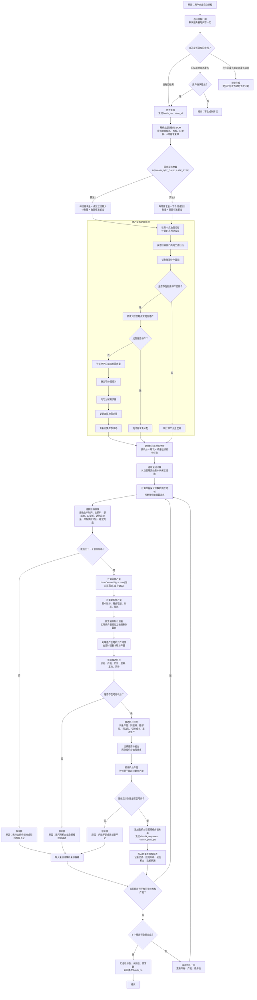
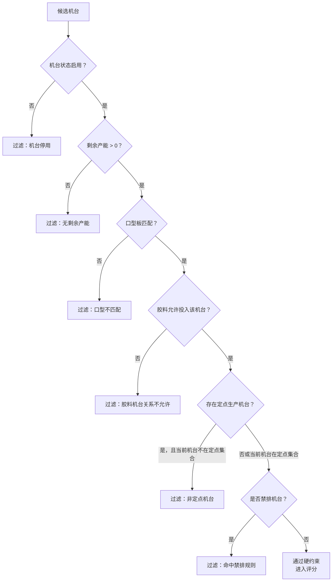
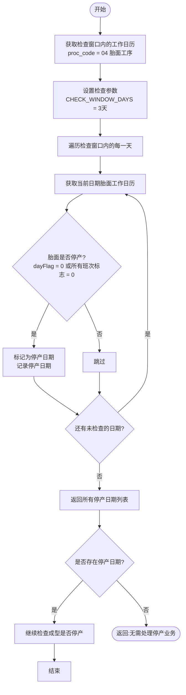
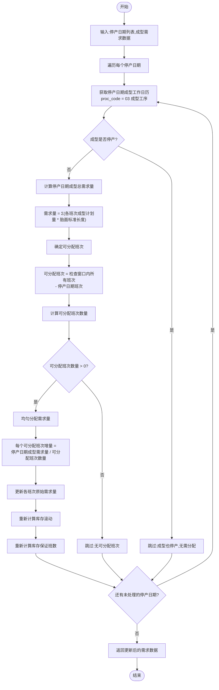
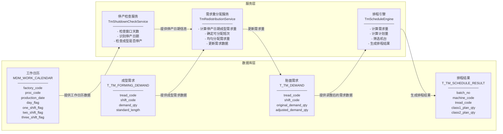

# 胎面自动排程算法流程图

本文根据 `docs/tm/tm_schedule_detailed_design.md` 整理，说明胎面自动排程怎么从成型需求、库存、胶料、口型板、机台约束一步步算出最终排程结果。

## 1. 一句话理解

胎面自动排程就是系统自动回答三个问题：

1. **要不要生产某个胎面**：看成型未来几个班要用多少胎面，以及当前 6 点库存够不够。
2. **生产多少**：先算需求缺口，再叠加工装、最小起排、卷曲长度、损耗率、机台产能等规则。
3. **放到哪台机、哪个班、哪个顺序**：先过滤不能生产的机台，再按评分选择最合适的机台，最后追加到机台任务链末尾。

如果某个胎面因为库存、工装、机台、口型板、胶料、定点或产能等规则排不上，也不能丢掉，仍然写入结果表，并在解释表里写明为什么未排。

## 2. 总流程图



## 3. 主流程拆解

### 3.1 生成前校验

系统先按 `factory_code + schedule_date` 查当天有没有旧排程：

| 情况 | 系统怎么处理 |
| --- | --- |
| 没有旧结果 | 直接允许生成 |
| 旧结果全部 `release_status = 0` 未发布 | 前端提示是否覆盖，用户确认后允许重新生成 |
| 旧结果存在任一非未发布数据 | 拒绝生成，避免覆盖已经发布或处理过的计划 |

生成时会创建：

- `batch_no`：本次排程批次号。
- `trace_id`：本次排程追踪号，用来串起日志、结果和解释。

### 3.2 先算需求，再看库存

系统从成型计划和胎胚 BOM 推导出每个胎面规格在未来 6 个班需要供应多少米。

需求算法由参数 `DEMAND_QTY_CALCULATE_TYPE` 控制：

```text
算法1：胎面每班需求量 = 成型三班最大计划量 × 胎面标准长度
算法2：胎面每班需求量 = 下个班成型计划量 × 胎面标准长度
```

库存从 6 点库存开始滚动：

```text
rollingStockQty(第1班开始) = sixClockStockQty - 早班胎面需求量 + 早班胎面计划量
rollingStockQty(下班开始) = rollingStockQty(当前班开始) + 当前班胎面计划量 - 当前班成型胎面需求量
```

这里的 `sixClockStockQty` 可以理解为“今天早上 6 点这个胎面已经有多少库存”。

### 3.3 判断库存能撑多久

参数 `TM_STOCK_GUARD_SHIFT_COUNT` 表示库存最低要保证几个班，默认 2 班。默认 2 班时，保证范围就是“当前班 + 下一个班”。

关键公式：

```text
guardDemandQty = 保证范围内成型胎面需求量合计
currentShiftDemandQty = 当前班成型胎面需求量
stockGapQty = max(guardDemandQty - rollingStockQty, 0)
baseDemandQty = max(currentShiftDemandQty, stockGapQty)
未来保证范围内胎面需求量 = 未来保证范围成型计划量 × 胎面标准长度
futureDemandPerHour = 未来保证范围内胎面需求量 / 未来保证范围总小时数
未来保证范围总小时数 = 未来保证范围内各班次小时数之和
supplyHours = rollingStockQty / futureDemandPerHour
```

解释：

- `guardDemandQty`：为了不让成型断料，保证范围内一共需要多少胎面。
- `stockGapQty`：库存还差多少才能覆盖保证范围。
- `baseDemandQty`：本班至少要考虑生产多少。它取“当前班需求”和“库存缺口”中较大的值。
- 如果未来保证范围需求为 0，`supplyHours` 不做除法，标记为空或 `NO_FUTURE_DEMAND`。

### 3.4 先排最紧急的胎面

待排规格不是随便排，而是按优先级进入队列。优先级从高到低为：

1. 最晚生产时间最小：当班的交接班库存不足以供成型的当班需求量时，计算最晚开始生产时间，预计开始时间越接近该时间点越优先。
2. 主胶料：尽量延续当前机台任务链末尾的主胶料，减少换胶。
3. 基部胶：主胶料不同但基部胶越相似，切换成本越低。
4. 口型板：相同口型板尽量集中生产，减少换口型。
5. 达到起排量：优先选择能达到最小起排量的规格，避免因量不足而无法排产。
6. 库存供应时长最小：库存保证班数越小、库存供应时长越短，越优先。
7. 稳定兜底：仍然相同则按 `tread_code`、`machine_code` 等固定字段升序，保证重复运行结果稳定。

最晚生产时间最小公式：

```text
最晚开始生产时间 = 库存不足时间 - 工艺停放时长 - 计划量 × 工艺生产速度
```

触发条件：当班的交接班库存不足以供成型的当班需求量时，才计算最晚开始生产时间并参与排序。
如果预计开始时间已经接近或晚于这个时间，就必须优先排这个胎面，不能为了同胶料连续而让成型断供。

### 3.5 计算计划量

系统选出一个胎面规格后，开始算本班到底排多少。

第一步，取基础需求：

```text
stockGapQty = max(guardDemandQty - rollingStockQty, 0)
baseDemandQty = max(currentShiftDemandQty, stockGapQty)
planQty初始值 = baseDemandQty
```

第二步，按最小起排和卷曲长度修正：

```text
如果 0 < planQty < TM_MIN_START_QTY，则补足到 TM_MIN_START_QTY
非收尾规格实际排产 = 向上取整(planQty / 卷曲长度) × 卷曲长度
```

第三步，收尾规格单独处理：

```text
胎面的余量 = 成型的余量 × 胎面长度 × (100% + 损耗率)
收尾规格实际排产 = min(planQty, 胎面的余量) × (100% + 损耗率)
```

经过第二步和第三步后，得到 `actual_plan_qty`（实际排产量）。

第四步，受工装约束：

```text
planQty = actual_plan_qty
当前可用工装数量 = 总工装数量 - (14点胎面预计库存 / 工装卷曲长度)
工装限制最大可排米数 = 当前可用工装数量 × 工装卷曲长度
planQty = min(planQty, 工装限制最大可排米数)
```

后续班次滚动工装：

```text
下班次可用工装数量 =
  上班次可用工装数量
  - 当前班计划量 / 工装卷曲长度
  + 成型对应班次胎面需求量 / 工装卷曲长度
```

第五步，受机台产能约束：

```text
扣减产能 = (检修时长H + 上个规格切换时长H + 上个胶料切换时长H) × 机台生产速度
机台剩余产能 = 胎面机台表最大产能 - 扣减产能 - 已排计划量
如果 planQty > 机台剩余产能，则 planQty 压缩到机台剩余产能
```

产能压缩后，计划量允许低于需求量，但不能超过机台剩余产能。

### 3.6 筛选机台

机台筛选先看硬约束。硬约束是“一票否决”，只要有一条不通过，就不能进入评分。



筛选数据来源：

| 规则 | 主要来源 |
| --- | --- |
| 机台状态、最大产能 | `T_TM_MACHINE_INFO` |
| 检修或停机 | `T_TM_MACHINE_MAINTENANCE` |
| 生产速度 | `T_TM_MACHINE_SPEED` |
| 口型板匹配 | `T_TM_MOUTH_PLATE` |
| 胶料机台关系 | `T_TM_GLUE_MACHINE_REAL` |
| 定点/禁排 | `T_TM_SPECIFY_MACHINE` |

### 3.7 机台评分

只有通过硬约束的机台才评分。默认评分项如下：

| 评分项 | 分值 | 说明 |
| --- | ---: | --- |
| 剩余产能适配 | 35 | 能容纳本次计划量，且更适合被排满的机台优先 |
| 主胶料连续 | 20 | 链尾主胶料和当前任务主胶料相同，减少换胶 |
| 基部胶相似 | 15 | 主胶料不同但基部胶相同越多越优先 |
| 同口型连续 | 10 | 链尾口型和当前任务口型相同，减少换口型 |
| 切换成本 | 10 | 规格切换、胶料切换时间越短越优先 |
| 定点生产 | 10 | 命中定点生产机台加分 |

如果总分完全一样，按机台编码升序选择，保证相同输入多次排程结果一致。

### 3.8 写结果和解释

已排任务写入：

```text
T_TM_SCHEDULE_RESULT
```

主要写入内容：

- `batch_no`：本次批次。
- `schedule_date`：排程日期。
- `machine_code`：选中的机台。
- `tread_code`：胎面编码。
- `glue_code`：主胶料。
- `mouth_plate_code`：口型板。
- `class1_sequence` ~ `class6_sequence`：各班顺序。
- `class1_plan_qty` ~ `class6_plan_qty`：各班计划量。
- `release_status = 0`：未发布。
- `data_source = 自动排程`。

解释信息写入：

```text
T_TM_SCHEDULE_RESULT_EXPLAIN
```

主要写入内容：

- 计划量怎么算出来的：`base_demand_qty`、`stock_deduct_qty`、`tool_limit_adjust_qty`、`min_start_adjust_qty`、`tail_round_adjust_qty`、`capacity_adjust_qty`、`final_plan_qty`、`calc_formula_desc`。
- 库存依据：`stock_qty`、`plan_stock_qty`、`supply_hours`、`coverage_shift_count`。
- 规则命中：`rule_hit_json`。
- 候选机台过程：`candidate_machine_json`。
- 最终选机原因：`machine_select_reason`。
- 未排原因：`unplanned_reason_code`、`unplanned_reason_desc`、`unplanned_evidence_json`。

### 3.9 停产业务逻辑处理

在胎面自动排程过程中，当胎面计划需要停产但成型计划不停产时，需要将停产日期对应的成型需求量重新分配到其他可排班次，确保成型生产线不会因为胎面停产而断供。

**业务场景**：
- 成型计划：未来N天（可配置）都有生产计划（不停产）
- 胎面计划：未来N天中的某一天需要停产
- 需求：将停产日期成型对胎面的需求量，均匀分配到其他可排班次

**参数配置**：

| 参数名称 | 参数代码 | 默认值 | 说明 |
|---------|---------|-------|------|
| 停产检查窗口天数 | `TM_SHUTDOWN_CHECK_WINDOW` | 3 | 检查未来几天内的停产情况，建议3-7天 |
| 停产业务逻辑开关 | `TM_SHUTDOWN_REDISTRIBUTION_ENABLED` | 1 | 是否启用停产业务逻辑处理 |

**计算公式**：

| 公式 | 说明 |
|-----|------|
| `成型需求量 = Σ(各班次成型计划量 × 胎面标准长度)` | 计算停产日期成型对胎面的总需求量 |
| `可分配班次 = 检查窗口内所有班次 - 停产日期班次` | 确定可以接受额外需求的班次 |
| `每个班次增量 = 停产日期成型需求量 / 可分配班次数量` | 均匀分配需求量到各可排班次 |
| `调整后需求量 = 原始需求量 + 增量` | 更新各班次的需求量 |

**停产检查子流程**：



**需求重分配子流程**：



**数据流转图**：



**示例**：

排程日期：2026-06-14，检查窗口：3天
- 胎面停产日期：2026-06-16
- 成型需求：2026-06-16成型需要1000米胎面
- 可分配班次：2026-06-14的3个班次和2026-06-15的3个班次（共6个班次）
- 每个班次增量：1000/6 ≈ 166.67米
- 2026-06-14和2026-06-15各班次需求量增加166.67米

## 4. 关键分支说明

### 4.1 为什么有时不生成新排程

如果当天已经有发布过的结果，系统拒绝重新生成。原因是发布后的结果可能已经给 MES 或现场使用，直接覆盖会导致现场计划和系统计划不一致。

### 4.2 为什么库存够也可能生产

库存够覆盖最低保证班数时，`baseDemandQty` 可以为 0。但后续仍可能因为收尾、开产、业务补量等规则产生计划量。是否最终排产，要继续看工装、最小起排、卷曲长度和产能。

### 4.3 为什么库存不足也可能排不上

库存不足只说明“应该优先考虑生产”，不代表一定能排上。还要满足：

- 有可用机台。
- 口型板能装在机台上。
- 胶料允许投这台机。
- 没有命中禁排。
- 工装数量足够。
- 机台剩余产能足够。
- 计划量满足业务规则。

### 4.4 为什么同胶料优先但不是永远优先

同胶料连续可以减少换胶，提高效率。但如果另一个胎面已经最晚生产时间最小，继续追求同胶料会导致成型断供，那么最晚生产时间最小优先级更高。

### 4.5 为什么未排也要写结果表

未排任务写入结果表和解释表，是为了让用户能看到“系统考虑过这个胎面，但因为哪些规则没有排上”。否则用户只能看到结果缺失，无法判断是漏算、数据问题，还是业务规则限制。

## 5. 公式汇总

| 公式 | 含义 |
| --- | --- |
| `胎面每班需求量 = 成型三班最大计划量 × 胎面标准长度` | 需求算法1 |
| `胎面每班需求量 = 下个班成型计划量 × 胎面标准长度` | 需求算法2 |
| `rollingStockQty(第1班开始) = sixClockStockQty - 早班胎面需求量 + 早班胎面计划量` | 第一个班使用14点预计库存（6点库存 - 早班需求量 + 早班计划量） |
| `rollingStockQty(下班开始) = 当前班开始库存 + 当前班胎面计划量 - 当前班成型需求量` | 库存逐班滚动 |
| `guardDemandQty = 保证范围内成型胎面需求量合计` | 保证范围内总需求 |
| `stockGapQty = max(guardDemandQty - rollingStockQty, 0)` | 最低库存保证缺口 |
| `baseDemandQty = max(currentShiftDemandQty, stockGapQty)` | 基础应排需求 |
| `supplyHours = rollingStockQty / futureDemandPerHour` | 库存预计还能供应多少小时 |
| `最晚开始生产时间 = 库存不足时间 - 工艺停放时长 - 计划量 × 工艺生产速度` | 最晚生产时间最小判断 |
| `非收尾实际排产 = 向上取整(planQty / 卷曲长度) × 卷曲长度` | 非收尾卷数取整 |
| `胎面的余量 = 成型的余量 × 胎面长度 × (100% + 损耗率)` | 收尾余量 |
| `收尾实际排产 = min(planQty, 胎面的余量) × (100% + 损耗率)` | 收尾排产量 |
| `当前可用工装数量 = 总工装数量 - (14点胎面预计库存 / 工装卷曲长度)` | 工装可用量 |
| `工装限制最大可排米数 = 当前可用工装数量 × 工装卷曲长度` | 工装约束下最多排多少 |
| `扣减产能 = (检修时长H + 上个规格切换时长H + 上个胶料切换时长H) × 机台生产速度` | 检修和切换占用的产能 |
| `机台剩余产能 = 胎面机台表最大产能 - 扣减产能 - 已排计划量` | 机台还能排多少 |
| `成型需求量 = Σ(各班次成型计划量 × 胎面标准长度)` | 停产日期成型对胎面的总需求量 |
| `可分配班次 = 检查窗口内所有班次 - 停产日期班次` | 确定可以接受额外需求的班次 |
| `每个班次增量 = 停产日期成型需求量 / 可分配班次数量` | 均匀分配需求量到各可排班次 |
| `调整后需求量 = 原始需求量 + 增量` | 更新各班次的需求量 |
| `未来保证范围内胎面需求量 = 未来保证范围成型计划量 × 胎面标准长度` | 未来保证范围内的胎面需求总量 |
| `futureDemandPerHour = 未来保证范围内胎面需求量 / 未来保证范围总小时数` | 未来平均每小时胎面需求量 |
| `未来保证范围总小时数 = 未来保证范围内各班次小时数之和` | 未来保证范围的总小时数 |
| `supplyHours = rollingStockQty / futureDemandPerHour` | 库存预计还能供应多少小时 |

## 6. 例子

假设一个胎面 `TR-215-001`：

| 项目 | 值 |
| --- | ---: |
| 6 点库存 | 1000 米 |
| 当前班需求 | 600 米 |
| 下个班需求 | 500 米 |
| 库存最低保证班数 | 2 班 |
| 工装总数 | 8 个 |
| 卷曲长度 | 200 米 |
| 最小起排量 | 450 米 |
| 机台最大产能 | 650 米 |
| 检修 + 切换占用产能 | 200 米 |

计算过程：

```text
保证范围需求 = 600 + 500 = 1100 米
库存缺口 = max(1100 - 1000, 0) = 100 米
基础应排需求 = max(当前班需求 600, 库存缺口 100) = 600 米

600 米大于最小起排量 450 米，不需要补最小起排
600 米正好是 200 米卷曲长度的整数倍，不需要卷数补齐
实际排产量 = 600 米

已占用工装 = 1000 / 200 = 5 个
当前可用工装 = 8 - 5 = 3 个
工装限制最大可排 = 3 × 200 = 600 米
工装限制后计划量 = min(600, 600) = 600 米

机台剩余产能 = 650 - 200 = 450 米
最终计划量 = min(600, 450) = 450 米
```

结论：虽然基础需求是 600 米，但机台扣除检修和切换后只剩 450 米产能，所以本班最终只能排 450 米。这个差异会写入解释表，用户能看到是“产能压缩”导致的。

## 7. 名词解释

| 名词 | 含义 |
| --- | --- |
| 胎面 | 轮胎生产中需要供应给成型工序的一类半成品 |
| 成型 | 使用胎面等物料组装轮胎胎胚的工序 |
| 6 点库存 | 当天早上 6 点 MES 或库存表记录的胎面库存快照 |
| 六班 | 排程日期内按 6 个班次滚动计算和展示 |
| 班次顺序 | `shift_order`，决定 CLASS1 到 CLASS6 的展示和计算顺序 |
| `batch_no` | 一次自动排程运行生成的批次号 |
| `trace_id` | 一次排程的追踪号，用于关联日志、结果、解释 |
| 滚动库存 | 每排完一个班，就用“上班库存 + 本班生产 - 本班消耗”算下个班库存 |
| 库存保证班数 | 当前库存可以覆盖几个班的成型消耗 |
| 库存供应时长 | 当前库存预计还能供应成型多少小时 |
| 最晚生产时间最小 | 如果不尽快生产就会晚于最晚开始生产时间，可能导致断供（仅当班交接班库存不足以供成型当班需求量时触发） |
| 主胶料 | 胎面生产使用的主要胶料 |
| 基部胶 | 胎面胶料组合中的基础胶料，用于判断切换相似度 |
| 口型板 | 生产胎面规格时需要使用的工装或模具类约束 |
| 工装卷曲长度 | 一个工装或一卷对应的胎面长度，用于卷数取整 |
| 最小起排量 | 小于该数量时，除非为 0，否则要补足到最低可生产量 |
| 收尾 | 月计划或成型余量即将结束时，按剩余量排产，不按普通补整规则无限放大 |
| 候选机台 | 理论上可能生产当前胎面的机台集合 |
| 硬约束 | 不满足就直接过滤的规则，例如停用、口型不匹配、禁排 |
| 评分 | 多台机都可生产时，用分数选择最合适机台 |
| 任务链 | 同一机台同一班次内按顺序排列的生产任务 |
| 未排 | 系统识别到有需求，但因为规则或资源限制没有排上 |
| 解释表 | `T_TM_SCHEDULE_RESULT_EXPLAIN`，保存为什么这么排、为什么没排上的证据 |
| 停产检查窗口天数 | 检查未来几天内的停产情况，参数`TM_SHUTDOWN_CHECK_WINDOW`，默认3天 |
| 停产业务逻辑开关 | 是否启用停产业务逻辑处理，参数`TM_SHUTDOWN_REDISTRIBUTION_ENABLED`，默认1 |
| 停产日期 | 胎面工作日历中`dayFlag=0`或所有班次标志都为0的日期 |
| 可分配班次 | 排程日期内所有班次减去停产日期班次，用于接收重新分配的需求量 |
| 停产需求重分配 | 将停产日期的成型需求量均匀分配到其他可排班次的处理逻辑 |

## 8. 最终结果长什么样

已排任务：

```text
T_TM_SCHEDULE_RESULT.machine_code = 选中的机台
T_TM_SCHEDULE_RESULT.classN_sequence = 当前机台当前班任务链顺序
T_TM_SCHEDULE_RESULT.classN_plan_qty = 最终计划量
T_TM_SCHEDULE_RESULT.release_status = 0
```

未排任务：

```text
T_TM_SCHEDULE_RESULT.machine_code = 空
T_TM_SCHEDULE_RESULT_EXPLAIN.assign_status = 未排
T_TM_SCHEDULE_RESULT_EXPLAIN.unplanned_reason_code = 未排原因编码
T_TM_SCHEDULE_RESULT_EXPLAIN.unplanned_reason_desc = 未排原因中文说明
T_TM_SCHEDULE_RESULT_EXPLAIN.unplanned_evidence_json = 规则证据
```

排程完成后，系统返回：

```text
RunSummary(batch_no, assigned_count, unassigned_count, error_count)
```

也就是本次批次号、已排数量、未排数量和异常数量。


未排：
根据上个班的交接班库存判断，如果不能供应当前班次的成型需求量，就需要记录异常(未排)，每个班次都需要判断

小胶种

备库班数，需要根据硫化机来计算，例：胎面对应的成型胎胚
